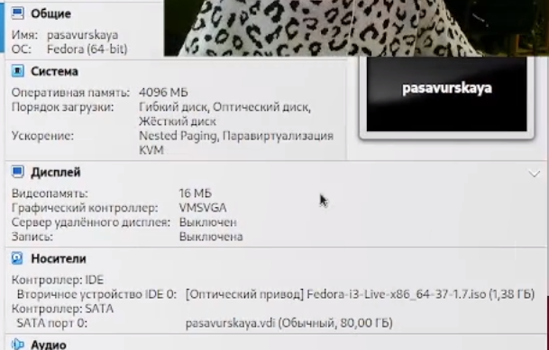
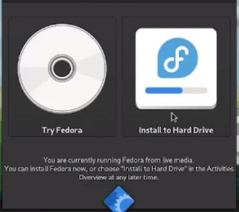

---
## Front matter
lang: ru-RU
title: Лабораторная работа 1
subtitle: Операционные системы
author:
  - Савурская П. А., студ.билет 1132222827
institute:
  - Российский университет дружбы народов, Москва, Россия
date: 15 февраля 2023

## i18n babel
babel-lang: russian
babel-otherlangs: english

## Formatting pdf
toc: false
toc-title: Содержание
slide_level: 2
aspectratio: 169
section-titles: true
theme: metropolis
header-includes:
 - \metroset{progressbar=frametitle,sectionpage=progressbar,numbering=fraction}
 - '\makeatletter'
 - '\beamer@ignorenonframefalse'
 - '\makeatother'
---

## Цель.

- Целью данной работы является приобретение практических навыков установки операционной системы на виртуальную машину, настройки минимально необходимых для дальнейшей работы сервисов.

## Выполнение лабораторной работы. Шаг 1.

- Так как на компьютере в ДК уже установлена виртуальная машина, то мы просто устанавливаем на нее дистрибутив Федора.

## Выполнение лабораторной работы. Шаг 2.

- Устанавливаем место, куда будут сохраняться видео из OBS.

{#fig:001 width=60%}

## Выполнение лабораторной работы. Шаг 3.

- Устанавливаем настройки для виртуальной машины.

{#fig:002 width=40%}

## Выполнение лабораторной работы. Шаг 4.

- Установка дистрибутива успешно завершена.

{#fig:003 width=60%}

## Выполнение лабораторной работы. Шаг 5.

- После установки дистрибутива выходит такое окошечко, там мы выбираем УСТАНОВИТЬ НА ЖЕСТКИЙ ДИСК.

{#fig:004 width=40%}

## Вывод.

- Сегодня я научилась создавать и запускать виртуальную машину с дистрибутивом федора.

