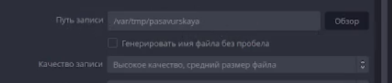
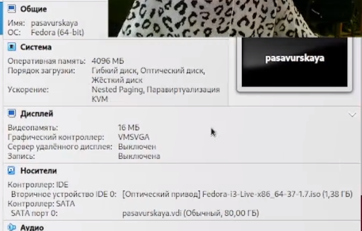
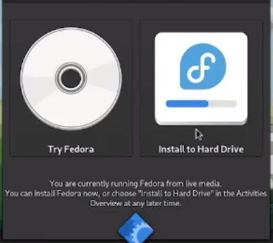

---
## Front matter
title: "Лабораторная работа 1"
subtitle: "Операционные системы"
author: "Савурская Полина"

## Generic otions
lang: ru-RU
toc-title: "Содержание"

## Bibliography
bibliography: bib/cite.bib
csl: pandoc/csl/gost-r-7-0-5-2008-numeric.csl

## Pdf output format
toc: true # Table of contents
toc-depth: 2
lof: true # List of figures
fontsize: 12pt
linestretch: 1.5
papersize: a4
documentclass: scrreprt
## I18n polyglossia
polyglossia-lang:
  name: russian
  options:
	- spelling=modern
	- babelshorthands=true
polyglossia-otherlangs:
  name: english
## I18n babel
babel-lang: russian
babel-otherlangs: english
## Fonts
mainfont: PT Serif
romanfont: PT Serif
sansfont: PT Sans
monofont: PT Mono
mainfontoptions: Ligatures=TeX
romanfontoptions: Ligatures=TeX
sansfontoptions: Ligatures=TeX,Scale=MatchLowercase
monofontoptions: Scale=MatchLowercase,Scale=0.9
## Biblatex
biblatex: true
biblio-style: "gost-numeric"
biblatexoptions:
  - parentracker=true
  - backend=biber
  - hyperref=auto
  - language=auto
  - autolang=other*
  - citestyle=gost-numeric
## Pandoc-crossref LaTeX customization
figureTitle: "Рис."
tableTitle: "Таблица"
listingTitle: "Листинг"
lofTitle: "Список иллюстраций"
lotTitle: "Список таблиц"
lolTitle: "Листинги"
## Misc options
indent: true
header-includes:
  - \usepackage{indentfirst}
  - \usepackage{float} # keep figures where there are in the text
  - \floatplacement{figure}{H} # keep figures where there are in the text
---

# Цель работы
Целью данной работы является приобретение практических навыков установки операционной системы на виртуальную машину, настройки минимально необходимых для дальнейшей работы сервисов.

# Задание

Дождитесь загрузки графического окружения и откройте терминал. В окне терминала проанализируйте последовательность загрузки системы, выполнив команду dmesg. Можно просто просмотреть вывод этой команды: dmesg | less
Можно использовать поиск с помощью grep: dmesg | grep -i "то, что ищем"
Получим следующую информацию.
        Версия ядра Linux (Linux version).
        Частота процессора (Detected Mhz processor).
        Модель процессора (CPU0).
        Объём доступной оперативной памяти (Memory available).
        Тип обнаруженного гипервизора (Hypervisor detected).
        Тип файловой системы корневого раздела.
        Последовательность монтирования файловых систем.

# Выполнение лабораторной работы

1) так как на компьютере в ДК уже установлена виртуальная машина, то мы просто устанавливаем на нее дистрибутив Федора.

2) устанавливаем место, куда будут сохраняться видео.

{#fig:001 width=90%}

3) устанавливаем настройки для виртуальной машины.

{#fig:002 width=70%}

4) установка дистрибутива успешно завершена.

{#fig:003 width=70%}

5) после установки дистрибутива выходит такое окошечко, там мы выбираем УСТАНОВИТЬ НА ЖЕСТКИЙ ДИСК.

{#fig:004 width=90%}

# Выводы

Сегодня я научилась создавать и запускать виртуальную машину с дистрибутивом федора.

