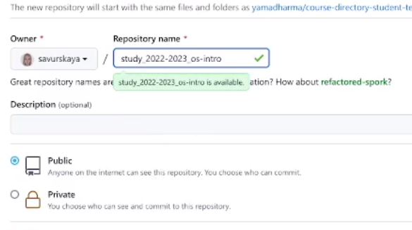
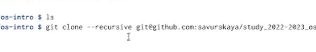
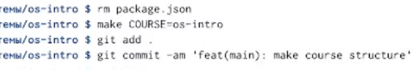
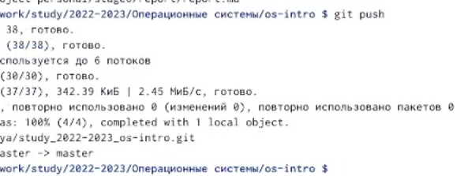

---
## Front matter
lang: ru-RU
title: Лабораторная работа 2
subtitle: Операционные системы
author:
  - Савурская П.А., студ.билет 1132222827
institute:
  - Российский университет дружбы народов, Москва, Россия
date: 15 февраля 2023

## i18n babel
babel-lang: russian
babel-otherlangs: english

## Formatting pdf
toc: false
toc-title: Содержание
slide_level: 2
aspectratio: 169
section-titles: true
theme: metropolis
header-includes:
 - \metroset{progressbar=frametitle,sectionpage=progressbar,numbering=fraction}
 - '\makeatletter'
 - '\beamer@ignorenonframefalse'
 - '\makeatother'
---

## Цель

- Изучить идеологию и применение средств контроля версий и освоить умения по работе с git.

## Выполнение лабораторной работы. Шаг 1

- Так как мой SSH ключ, который я создала в сентябре, все еще рабочий, в этой л/р я его не создавала.

## Выполнение лабораторной работы. Шаг 2

- Создаю на Гитхаб новый репозиторий для операционных систем.

{#fig:001 width=70%}

## Выполнение лабораторной работы. Шаг 3

- Создаю шаблон рабочего пространства с помощью команды git clone.

{#fig:002 width=70%}

## Выполнение лабораторной работы. Шаг 4

- Удаляю лишние файлы, создаю необходимые каталоги.

{#fig:003 width=70%}

## Выполнение лабораторной работы. Шаг 5

- Отправляю файлы на сервер.

{#fig:004 width=70%}

## Вывод

- Я освоила применение средства контроля версий, а также получила умения работы с git.
