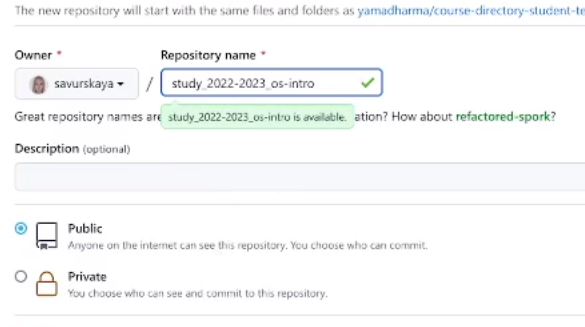
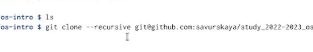
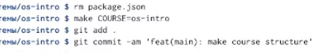
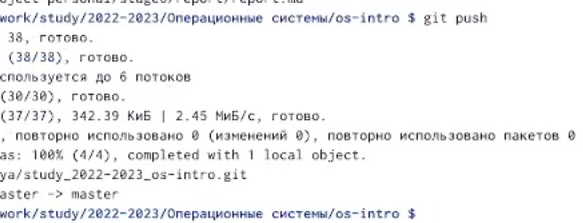

---
## Front matter
title: "Лабораторная работа 2"
subtitle: "Операционные системы"
author: "Савурская Полина"

## Generic otions
lang: ru-RU
toc-title: "Содержание"

## Bibliography
bibliography: bib/cite.bib
csl: pandoc/csl/gost-r-7-0-5-2008-numeric.csl

## Pdf output format
lof: true # List of figures
fontsize: 12pt
linestretch: 1.5
papersize: a4
documentclass: scrreprt
## I18n polyglossia
polyglossia-lang:
  name: russian
  options:
	- spelling=modern
	- babelshorthands=true
polyglossia-otherlangs:
  name: english
## I18n babel
babel-lang: russian
babel-otherlangs: english
## Fonts
mainfont: PT Serif
romanfont: PT Serif
sansfont: PT Sans
monofont: PT Mono
mainfontoptions: Ligatures=TeX
romanfontoptions: Ligatures=TeX
sansfontoptions: Ligatures=TeX,Scale=MatchLowercase
monofontoptions: Scale=MatchLowercase,Scale=0.9
## Biblatex
biblatex: true
biblio-style: "gost-numeric"
biblatexoptions:
  - parentracker=true
  - backend=biber
  - hyperref=auto
  - language=auto
  - autolang=other*
  - citestyle=gost-numeric
## Pandoc-crossref LaTeX customization
figureTitle: "Рис."
tableTitle: "Таблица"
listingTitle: "Листинг"
lofTitle: "Список иллюстраций"
lotTitle: "Список таблиц"
lolTitle: "Листинги"
## Misc options
indent: true
header-includes:
  - \usepackage{indentfirst}
  - \usepackage{float} # keep figures where there are in the text
  - \floatplacement{figure}{H} # keep figures where there are in the text
---

# Цель работы

Изучить идеологию и применение средств контроля версий и освоить умения по работе с git.

# Задание

Ответить на контрольные вопросы:
1) Что такое системы контроля версий (VCS) и для решения каких задач они предназначаются?
2) Объясните следующие понятия VCS и их отношения: хранилище, commit, история, рабочая копия.
3) Что представляют собой и чем отличаются централизованные и децентрализованные VCS? Приведите примеры VCS каждого вида.
4) Каковы основные задачи, решаемые инструментальным средством git?
5) Что такое и зачем могут быть нужны ветви (branches)?

# Выполнение лабораторной работы

1) Так как мой SSH ключ, который я создала в сентябре, все еще рабочий, в этой л/р я его не создавала.

2) Создаю на Гитхаб новый репозиторий для операционных систем.

{#fig:001 width=70%}

3) Создаю шаблон рабочего пространства с помощью команды git clone.

{#fig:002 width=70%}

4) Удаляю лишние файлы, создаю необходимые каталоги.

{#fig:003 width=70%}

5) Отправляю файлы на сервер.

{#fig:004 width=70%}

#Ответы на контрольные вопросы

1) Система контроля версий (VCS) — это система, регистрирующая изменения в одном или нескольких файлах с тем, чтобы в дальнейшем была возможность вернуться к определённым старым версиям этих файлов.

2) Хранилище-система, которая обеспечивает хранение всех существовавших вариантов файлов Commit фиксация изменений История-список предыдущих ревизий Рабочая копия-копия другой ветки Команде commit можно передать сообщение, описывающее изменения в ревизии. Она также записывает идентификатор пользователя, текущее время и временную зону, плюс список измененных файлов и их содержимого. Сообщение, описывающее изменения, определяется через опцию -m, или – message. Можно также вводить сообщения, состоящие из нескольких строк; в большинстве оболочек вы можете сделать это оставив открытую кавычку в конце строки. commit -m "добавлен первый файл.

3) Системы контроля версий. Централизованная система контроля версий Subversion и децентрализованная система контроля версий Mercurial. Существуют СКВ централизованные, в которых имеется один репозиторий, в который собираются изменения со всех рабочих копий разработчиков, и децентрализованные, когда репозиториев много, и они могут обмениваться изменениями между собой. Централизованные СКВ - репозиторий один. У каждого разработчика своя рабочая копия. Время от времени разработчик может затягивать к себе в рабочую копию новые изменения из репозитория, или проталкивать свои изменения из своей рабочей копии в репозиторий. Прочие особенности централизованных СКВ зависят от реализации.

4) Основные задачи: создание ветки, размещение веток, просмотр изменений, фиксация изменений, сообщение из текстового редактора, выборочная фиксация, удаление зафиксированных изменений, игнорирование файлов, просмотр истории, статистика ветки, контроль файлов и каталогов, ветвление, объединение веток, публикация ветки.

5) Часто вместо того что бы начинать свой собственный проект, вы хотите предложить изменения для уже готового проекта. Что бы сделать это вам нужно получить копию готовой ветки. Так как эта копия может быть потенциальной новой веткой эта команда называется branch: Управление версиями git branch cd git.dev Эта команда копирует полную историю ветки и после этого вы можете делать все операции с ней локально: просматривать журнал, создавать и объединять другие ветки.

# Выводы

Я освоила применение средства контроля версий, а также получила умения работы с git.

