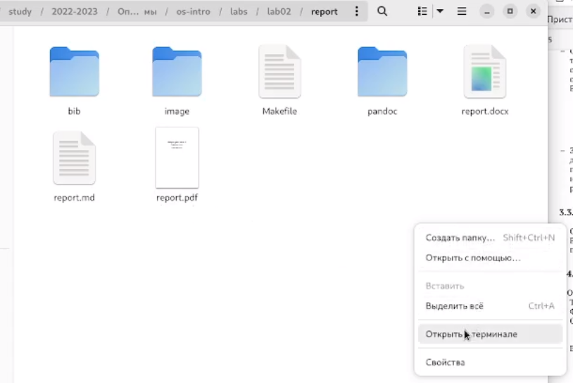
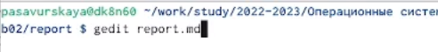
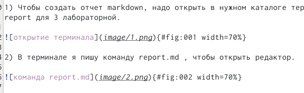
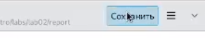
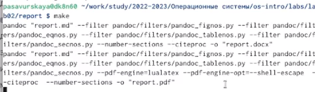

---
## Front matter
lang: ru-RU
title: Лабораторная работа 3
subtitle: Операционные системы
author:
  - Савурская П.А.
institute:
  - Российский университет дружбы народов, Москва, Россия
date: 16 февраля 2023

## i18n babel
babel-lang: russian
babel-otherlangs: english

## Formatting pdf
toc: false
toc-title: Содержание
slide_level: 2
aspectratio: 169
section-titles: true
theme: metropolis
header-includes:
 - \metroset{progressbar=frametitle,sectionpage=progressbar,numbering=fraction}
 - '\makeatletter'
 - '\beamer@ignorenonframefalse'
 - '\makeatother'
---

## Цель

– Сделайте отчёт по предыдущей лабораторной работе в формате Markdown.
– В качестве отчёта просьба предоставить отчёты в 3 форматах: pdf, docx и md (в архиве, поскольку он должен содержать скриншоты, Makefile и т.д.)

## Выполнение лабораторной работы. Шаг 1

Чтобы создать отчет markdown, надо открыть в нужном каталоге терминал. В моем случае это каталог report для 3 лабораторной.

{#fig:001 width=70%}

## Выполнение лабораторной работы. Шаг 2

В терминале я пишу команду report.md , чтобы открыть редактор.

{#fig:002 width=70%}

## Выполнение лабораторной работы. Шаг 3

Начинаем менять заданные данные на свои.

{#fig:003 width=70%}

## Выполнение лабораторной работы. Шаг 4

Пишу основную информацию, подкрепляю к ней картинки таким способов:

{#fig:004 width=70%}

## Выполнение лабораторной работы. Шаг 5

После редактирования документа нажимаю "Сохранить"

{#fig:005 width=70%}

## Выполнение лабораторной работы. Шаг 6

После закрытия документа прописываю в терминале команду make(make clean если нужно удалить предыдущие копии)

{#fig:006 width=70%}

## Вывод.

Я научилась оформлять отчеты через язык разметки Markdown.

