---
## Front matter
lang: ru-RU
title: Лабораторная работа 4
subtitle: Операционные системы
author:
  - Савурская П. А.
institute:
  - Российский университет дружбы народов, Москва, Россия
date: 22 февраля 2023

## i18n babel
babel-lang: russian
babel-otherlangs: english

## Formatting pdf
toc: false
toc-title: Содержание
slide_level: 2
aspectratio: 169
section-titles: true
theme: metropolis
header-includes:
 - \metroset{progressbar=frametitle,sectionpage=progressbar,numbering=fraction}
 - '\makeatletter'
 - '\beamer@ignorenonframefalse'
 - '\makeatother'
---

## Цель.

Приобретение практических навыков взаимодействия пользователя с системой по-
средством командной строки.

## Шаг 1.

Определим полное имя домашнего каталога.

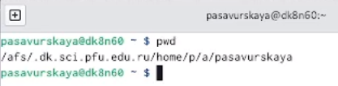{#fig:001 width=70%}

## Шаг 2.

Перейдем в каталог tmp.

{#fig:002 width=70%}

## Шаг 3.

Посмотрим его содержимое.
 
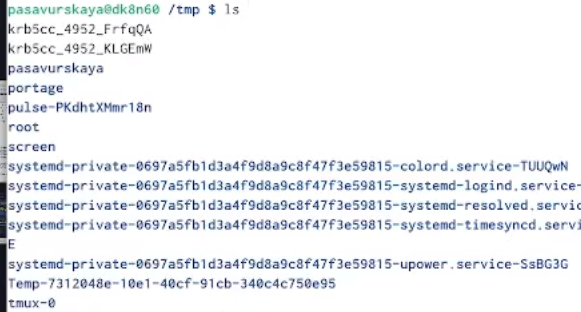{#fig:003 width=70%}

## Шаг 4.

Команда ls -a показывает скрытые файлы.

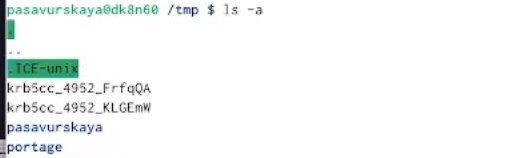{#fig:004 width=70%}

## Шаг 5.

Посмотрим, есть ли в каталоге /var/spool каталог cron.

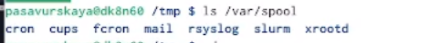{#fig:005 width=70%}

## Шаг 6.

В домашнем каталоге создаем каталог newdir, и проверим, создался ли он.

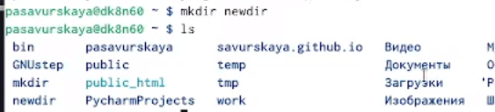{#fig:006 width=70%}

## Шаг 7.

В каталоге newdir создаем каталог morefun.

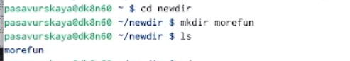{#fig:007 width=70%}

## Шаг 8.

В домашнем каталоге создаю одной командой три новых каталога с именами letters, memos, mask. Затем удалим эти каталоги одной командой.

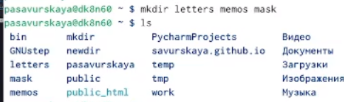{#fig:008 width=70%}

## Шаг 9.

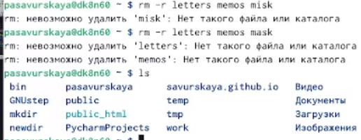{#fig:009 width=70%}

## Шаг 10.

Удалим ранее созданный каталог ~/newdir командой rm. Каталог удалился.

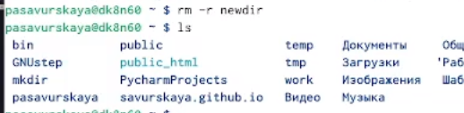{#fig:010 width=70%}

## Шаг 11.

С помощью команды man смотрим описание разных команд.

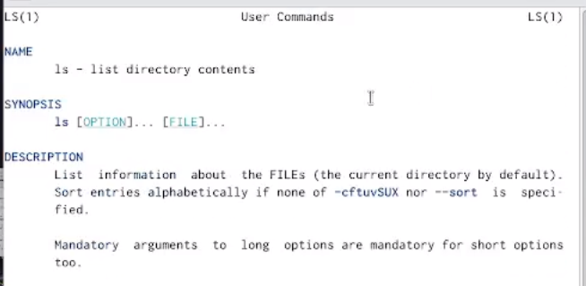{#fig:011 width=70%}

## Шаг 12.

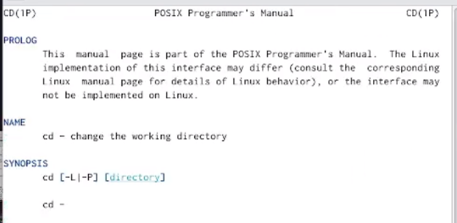{#fig:012 width=70%}

## Шаг 13.

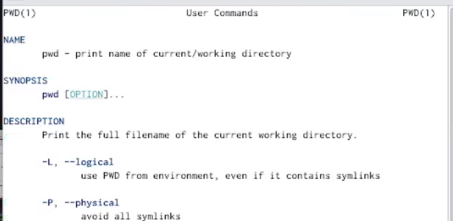{#fig:013 width=70%}

## Шаг 14.

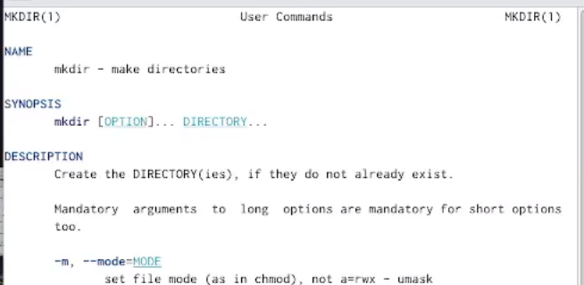{#fig:014 width=70%}

## Шаг 15.

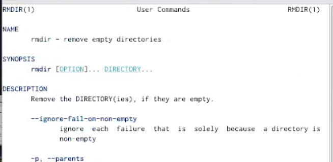{#fig:015 width=70%}

## Шаг 16.

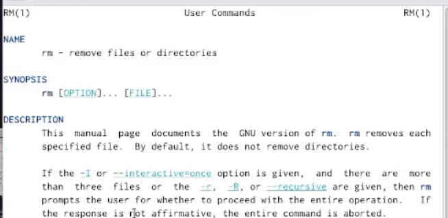{#fig:016 width=70%}

## Шаг 17.

Команда history показывает историю введенных команд.

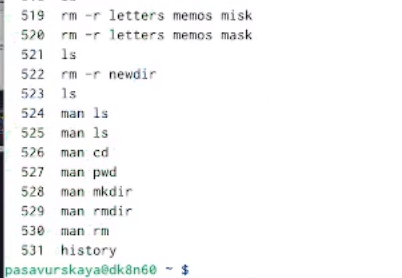{#fig:017 width=70%}

## Выводы

Я приобрела практические навыки взаимодействия пользователя с системой посредством командной строки.

