---
## Front matter
title: "Лабораторная работа 4"
subtitle: "Операционные системы"
author: "Савурская Полина"

## Generic otions
lang: ru-RU
toc-title: "Содержание"

## Bibliography
bibliography: bib/cite.bib
csl: pandoc/csl/gost-r-7-0-5-2008-numeric.csl

## Pdf output format
toc: true # Table of contents
toc-depth: 2
lof: true # List of figures
fontsize: 12pt
linestretch: 1.5
papersize: a4
documentclass: scrreprt
## I18n polyglossia
polyglossia-lang:
  name: russian
  options:
	- spelling=modern
	- babelshorthands=true
polyglossia-otherlangs:
  name: english
## I18n babel
babel-lang: russian
babel-otherlangs: english
## Fonts
mainfont: PT Serif
romanfont: PT Serif
sansfont: PT Sans
monofont: PT Mono
mainfontoptions: Ligatures=TeX
romanfontoptions: Ligatures=TeX
sansfontoptions: Ligatures=TeX,Scale=MatchLowercase
monofontoptions: Scale=MatchLowercase,Scale=0.9
## Biblatex
biblatex: true
biblio-style: "gost-numeric"
biblatexoptions:
  - parentracker=true
  - backend=biber
  - hyperref=auto
  - language=auto
  - autolang=other*
  - citestyle=gost-numeric
## Pandoc-crossref LaTeX customization
figureTitle: "Рис."
listingTitle: "Листинг"
lofTitle: "Список иллюстраций"
lolTitle: "Листинги"
## Misc options
indent: true
header-includes:
  - \usepackage{indentfirst}
  - \usepackage{float} # keep figures where there are in the text
  - \floatplacement{figure}{H} # keep figures where there are in the text
---

# Цель работы

Приобретение практических навыков взаимодействия пользователя с системой по-
средством командной строки.

# Задание

1. Определите полное имя вашего домашнего каталога. Далее относительно этого каталога будут выполняться последующие упражнения.
2. Выполните следующие действия:
2.1. Перейдите в каталог /tmp.
2.2. Выведите на экран содержимое каталога /tmp. Для этого используйте команду ls с различными опциями. Поясните разницу в выводимой на экран информации.
2.3. Определите, есть ли в каталоге /var/spool подкаталог с именем cron?
2.4. Перейдите в Ваш домашний каталог и выведите на экран его содержимое. Определите, кто является владельцем файлов и подкаталогов?
3. Выполните следующие действия:
3.1. В домашнем каталоге создайте новый каталог с именем newdir.
3.2. В каталоге ~/newdir создайте новый каталог с именем morefun.
3.3. В домашнем каталоге создайте одной командой три новых каталога с именами letters, memos, misk. Затем удалите эти каталоги одной командой.
3.4. Попробуйте удалить ранее созданный каталог ~/newdir командой rm. Проверьте, был ли каталог удалён.
3.5. Удалите каталог ~/newdir/morefun из домашнего каталога. Проверьте, был ли каталог удалён.
4. С помощью команды man определите, какую опцию команды ls нужно использовать для просмотра содержимое не только указанного каталога, но и подкаталогов, входящих в него.
5. С помощью команды man определите набор опций команды ls, позволяющий отсортировать по времени последнего изменения выводимый список содержимого каталога с развёрнутым описанием файлов.
6. Используйте команду man для просмотра описания следующих команд: cd, pwd, mkdir,rmdir, rm. Поясните основные опции этих команд.
7. Используя информацию, полученную при помощи команды history, выполните модификацию и исполнение нескольких команд из буфера команд.

# Выполнение лабораторной работы

1) Определим полное имя домашнего каталога.

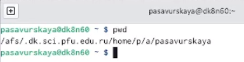{#fig:001 width=70%}

2) Перейдем в каталог tmp.

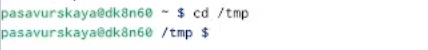{#fig:002 width=70%}

3) Посмотрим его содержимое.
 
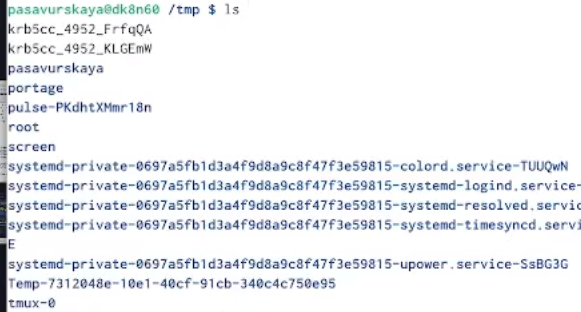{#fig:003 width=70%}

4) Команда ls -a показывает скрытые файлы.

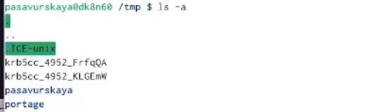{#fig:004 width=70%}

5) Посмотрим, есть ли в каталоге /var/spool каталог cron.

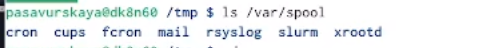{#fig:005 width=70%}

6) В домашнем каталоге создаем каталог newdir, и проверим, создался ли он.

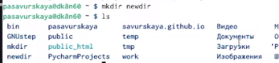{#fig:006 width=70%}

7) В каталоге newdir создаем каталог morefun.

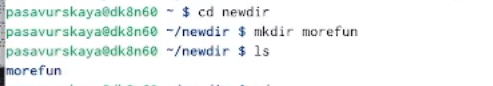{#fig:007 width=70%}

8) В домашнем каталоге создаю одной командой три новых каталога с именами letters, memos, mask. Затем удалим эти каталоги одной командой.

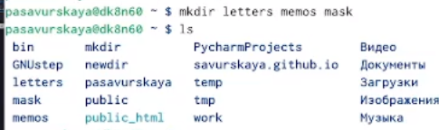{#fig:008 width=70%}

{#fig:009 width=70%}

9) Удалим ранее созданный каталог ~/newdir командой rm. Каталог удалился.

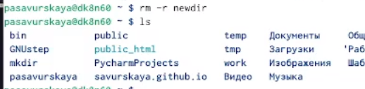{#fig:010 width=70%}

10) С помощью команды man смотрим описание разных команд.

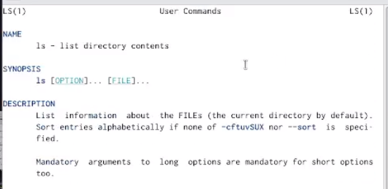{#fig:011 width=70%}

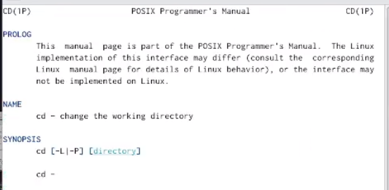{#fig:012 width=70%}

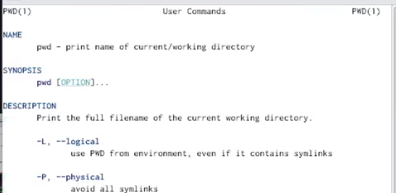{#fig:013 width=70%}

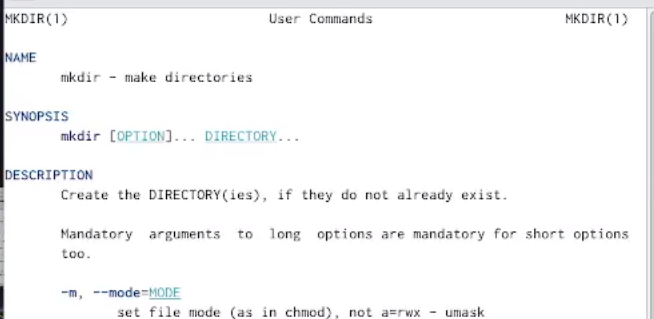{#fig:014 width=70%}

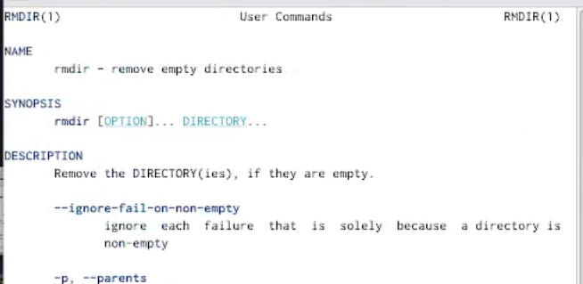{#fig:015 width=70%}

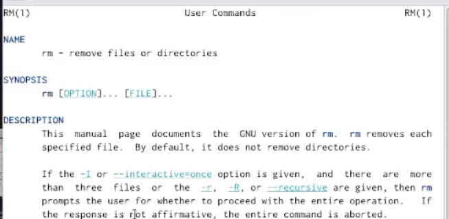{#fig:016 width=70%}

11) Команда history показывает историю введенных команд.

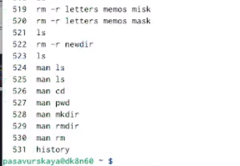{#fig:017 width=70%}

# Ответы на контрольные вопросы

1) Что такое командная строка?
Интерфейс командной строки - управление программами с помощью команд. Команды состоят из букв, цифр, символов, набираются построчно, выполняются после нажатия клавиши Enter. Основной инструмент здесь клавиатура. Данный интерфейс встроен в ядро системы, он будет доступен, даже если графический интерфейс не запустится. Добраться до командной строки можно двумя способами: через консоль или терминал.

2) При помощи какой команды можно определить абсолютный путь текущего каталога? 
При помощи команды realpath можно определить абсолютный путь текущего каталога. 

3) При помощи какой команды и каких опций можно определить только тип файлов и их имена в текущем каталоге? 
При помощи команды ls -F можно определить только тип файлов и их имена в текущем каталоге.

4) Каким образом отобразить информацию о скрытых файлах? 
По умолчанию файловые менеджеры обычно не отображают такие файлы. Для просмотра списка файлов в командной строке используется команда ls. Чтобы по команде ls также выводились скрытые файлы, существует опция -a.

5) При помощи каких команд можно удалить файл и каталог? Можно ли это сделать одной и той же командой?
При помощи команд rm и rmdir можно удалить файл и каталог. Это нельзя сделать одной и той же командой.

6) Каким образом можно вывести информацию о последних выполненных пользователем командах? 
Определить какие команды выполнил пользователь в сеансе работы можно с помощь команды history.

7)Как получить информацию об интересующей вас команде?
Получить информацию об интересующей вас команде можно с помощью команды man. Например, команда man ls выведет все опции команды ls.

8) Какая клавиша или комбинация клавиш служит для автоматического дополнения вводимых команд?
Сочетание клавиш Ctrl+C прерывает текущий процесс, запущенный в терминале.

# Выводы

Я приобрела практические навыки взаимодействия пользователя с системой посредством командной строки.

