---
## Front matter
lang: ru-RU
title: Лабораторная работа 5
subtitle: Операционные системы
author:
  - Савурская П. А., №ст.б. 1132222827
institute:
  - Российский университет дружбы народов, Москва, Россия
date: 01 марта 2023

## i18n babel
babel-lang: russian
babel-otherlangs: english

## Formatting pdf
toc: false
toc-title: Содержание
slide_level: 2
aspectratio: 169
section-titles: true
theme: metropolis
header-includes:
 - \metroset{progressbar=frametitle,sectionpage=progressbar,numbering=fraction}
 - '\makeatletter'
 - '\beamer@ignorenonframefalse'
 - '\makeatother'
---

## Цели и задачи

Ознакомление с файловой системой Linux, её структурой, именами и содержанием каталогов. Приобретение практических навыков по применению команд для работы с файлами и каталогами, по управлению процессами (и работами), по проверке использования диска и обслуживанию файловой системы.

## Примеры.Шаг 1

1) Это разные примеры копирования файлов.

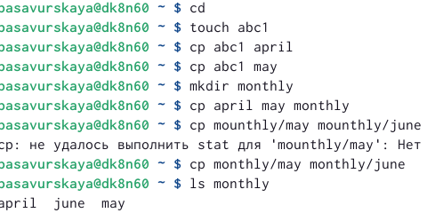{#fig:001 width=50%}

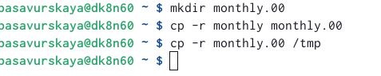{#fig:002 width=50%}

## Примеры.Шаг 2

Примеры переименования и перемещения.

{#fig:003 width=70%}

## Примеры.Шаг 3

Пример с командами для прав доступа.

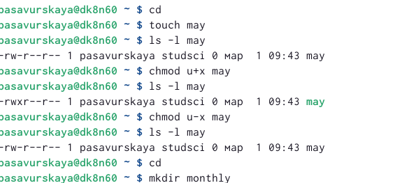{#fig:004 width=50%}

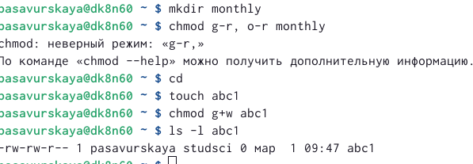{#fig:005 width=50%}

## Лабораторная работа. Шаг 1

Скопируем файл /usr/include/sys/io.h в домашний каталог и назовем его equipment.

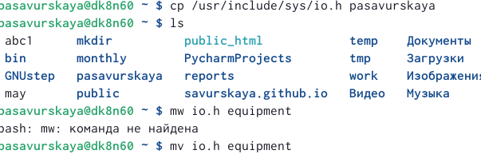{#fig:006 width=70%}

## Лабораторная работа. Шаг 2

В домашнем каталоге создаю директорию ~/ski.plaсes

{#fig:007 width=70%}

## Лабораторная работа. Шаг 3

Переместим файл equipment в каталог ~/ski.plases

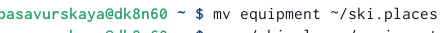{#fig:008 width=70%}

## Лабораторная работа. Шаг 4

Переименуем файл ~/ski.plases/equipment в ~/ski.plases/equiplist

{#fig:009 width=70%}

## Лабораторная работа. Шаг 5

Создаю файл abc1.

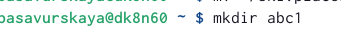{#fig:010 width=70%}

## Лабораторная работа. Шаг 6

Скопируйте его в каталог ~/ski.plases, назовите его equiplist2.

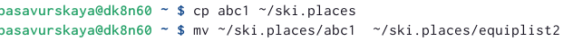{#fig:011 width=70%}

## Лабораторная работа. Шаг 7

Создаем каталог с именем equipment в каталоге ~/ski.plases.

{#fig:012 width=70%}

## Лабораторная работа. Шаг 8

Переместим файлы ~/ski.plases/equiplist и equiplist2 в каталог ~/ski.plases/equipment.

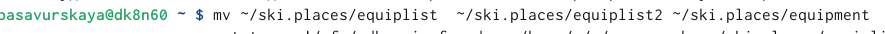{#fig:013 width=70%}

## Лабораторная работа. Шаг 9

Создайте и переместите каталог ~/newdir в каталог ~/ski.plases и назовите его plans.

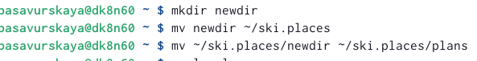{#fig:014 width=70%}

## Лабораторная работа. Шаг 10

10) Определим опции команды chmod, необходимые для того, чтобы присвоить файлу australia выделенные права доступа.

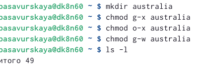{#fig:015 width=70%}

## Лабораторная работа. Шаг 11

Скопируем файл ~/feathers в файл ~/file.old.

{#fig:016 width=70%}

## Лабораторная работа. Шаг 12

Переместим файл ~/file.old в каталог ~/play.

{#fig:017 width=70%}

## Лабораторная работа. Шаг 13

Скопируем каталог ~/play в каталог ~/fun.

{#fig:018 width=70%}

## Лабораторная работа. Шаг 14

Переместите каталог ~/fun в каталог ~/play и назовите его games.

{#fig:019 width=50%}

{#fig:020 width=50%}

## Лабораторная работа. Шаг 15

Лишим владельца файла ~/feathers права на чтение.

{#fig:021 width=70%}

## Лабораторная работа. Шаг 16

Лишите владельца каталога ~/play права на выполнение.

{#fig:022 width=70%}

## Лабораторная работа. Шаг 17

Дадим владельцу каталога ~/play право на выполнение.

{#fig:023 width=70%}

## Лабораторная работа. Шаг 18

Команды man:

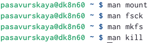{#fig:024 width=70%}

## Вывод

Я ознакомилась с файловой системой Linux, её структурой, именами и содержанием каталогов, приобрела практические навыки по применению команд для работы с файлами и каталогами.

