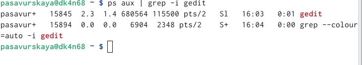

---
## Front matter
lang: ru-RU
title: Лабораторная работа 6
subtitle: Операционные системы
author:
  - Савурская П. А., №ст.б. 1132222827
institute:
  - Российский университет дружбы народов, Москва, Россия
date: 06 марта 2023

## i18n babel
babel-lang: russian
babel-otherlangs: english

## Formatting pdf
toc: false
toc-title: Содержание
slide_level: 2
aspectratio: 169
section-titles: true
theme: metropolis
header-includes:
 - \metroset{progressbar=frametitle,sectionpage=progressbar,numbering=fraction}
 - '\makeatletter'
 - '\beamer@ignorenonframefalse'
 - '\makeatother'
---

## Цели и задачи

Ознакомление с инструментами поиска файлов и фильтрации текстовых данных. Приобретение практических навыков: по управлению процессами (и заданиями), по проверке использования диска и обслуживанию файловых систем.

## Лабораторная работа. Шаг 1

Запишем в файл file.txt названия файлов, содержащихся в каталоге /etc. Допишем в этот же файл названия файлов, содержащихся в домашнем каталоге.

{#fig:001 width=50%}

{#fig:002 width=50%}

## Лабораторная работа. Шаг 2

Выведем имена всех файлов из file.txt, имеющих расширение .conf, после чего запишем их в новый текстовой файл conf.txt.

{#fig:003 width=50%}

{#fig:004 width=50%}

## Лабораторная работа. Шаг 3

Определим, какие файлы в домашнем каталоге имеют имена, начинавшиеся с символа c. Это можно сделать двумя способами: 

{#fig:005 width=70%}

## Лабораторная работа. Шаг 4

Выведем на экран (по странично) имена файлов из каталога /etc, начинающиеся с символа h.

{#fig:006 width=70%}

## Лабораторная работа. Шаг 5

Запустим в фоновом режиме процесс, который будет записывать в файл ~/logfile файлы, имена которых начинаются с log. И сразу же удалим файл logfile.

{#fig:007 width=70%}

## Лабораторная работа. Шаг 6

Запустим из консоли в фоновом режиме редактор gedit. Определяем идентификатор процесса gedit, используя команду ps, конвейер и фильтр grep.

{#fig:008 width=70%}

## Лабораторная работа. Шаг 7

Прочтем справку команды kill, после чего используем её для завершения процесса gedit.

{#fig:009 width=50%}

{#fig:010 width=50%}

## Лабораторная работа. Шаг 8

С помощью команды man, получаем более подробную информацию о командах df и du.

{#fig:011 width=70%}

## Лабораторная работа. Шаг 9

Выполняем команду df.

{#fig:012 width=70%}

## Лабораторная работа. Шаг 10

Выполняем команду du.

{#fig:013 width=70%}

## Лабораторная работа. Шаг 11

Воспользовавшись справкой команды find, выведем имена всех директорий, имеющихся в домашнем каталоге.

{#fig:014 width=70%}

## Вывод

Я ознакомилась с файловой системой Linux, её структурой, именами и содержанием каталогов, приобрела практические навыки по применению команд для работы с файлами и каталогами.

