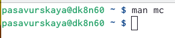
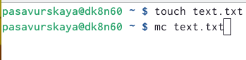
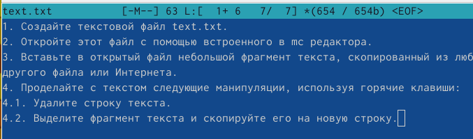
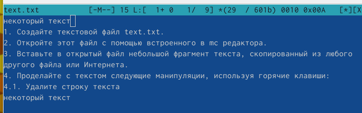
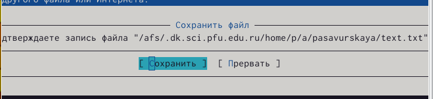
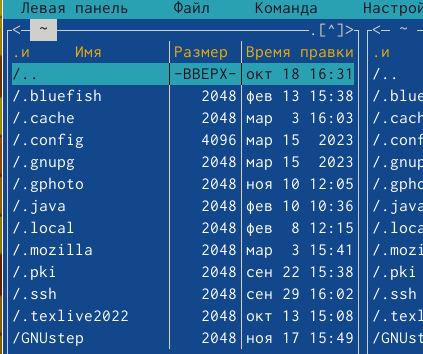

---
## Front matter
lang: ru-RU
title: Лабораторная работа №7
subtitle: Операционные системы
author:
  - Савурская П. А.
institute:
  - Российский университет дружбы народов, Москва, Россия
date: 15 марта 2023

## i18n babel
babel-lang: russian
babel-otherlangs: english

## Formatting pdf
toc: false
toc-title: Содержание
slide_level: 2
aspectratio: 169
section-titles: true
theme: metropolis
header-includes:
 - \metroset{progressbar=frametitle,sectionpage=progressbar,numbering=fraction}
 - '\makeatletter'
 - '\beamer@ignorenonframefalse'
 - '\makeatother'
---

## Докладчик

:::::::::::::: {.columns align=center}
::: {.column width="70%"}

  * Савурская Полина Александровна
  * студентка Бизнес-информатики
  * Российский университет дружбы народов
  * № студ.билета 1132222827

:::
::: {.column width="30%"}

:::
::::::::::::::

## Цель работы

Освоение основных возможностей командной оболочки Midnight Commander. Приобретение навыков практической работы по просмотру каталогов и файлов; манипуляций с ними.

## Задание по mc:

1. Изучите информацию о mc, вызвав в командной строке man mc.

2. Запустите из командной строки mc, изучите его структуру и меню.

3. Выполните несколько операций в mc, используя управляющие клавиши (операции с панелями; выделение/отмена выделения файлов, копирование/перемещение файлов, получение информации о размере и правах доступа на файлы и/или каталоги и т.п.)

4. Выполните основные команды меню левой (или правой) панели. Оцените степень
подробности вывода информации о файлах.

## Задание по встроенному редактору mc:

1. Создайте текстовой файл text.txt.

2. Откройте этот файл с помощью встроенного в mc редактора. 

3. Вставьте в открытый файл небольшой фрагмент текста, скопированный из любого другого файла или Интернета.

4. Проделайте с текстом следующие манипуляции, используя горячие клавиши:
4.1. Удалите строку текста.
4.2. Выделите фрагмент текста и скопируйте его на новую строку.
4.3. Выделите фрагмент текста и перенесите его на новую строку.
4.4. Сохраните файл.
4.5. Отмените последнее действие.
4.6. Перейдите в конец файла (нажав комбинацию клавиш) и напишите некоторый текст.
4.7. Перейдите в начало файла (нажав комбинацию клавиш) и напишите некоторый текст.
4.8. Сохраните и закройте файл.

5. Откройте файл с исходным текстом на некотором языке программирования 

6. Используя меню редактора, включите подсветку синтаксиса, если она не включена, или выключите, если она включена.

## Выполнение лабораторной работы. Шаг 1.

Изучим информацию про mc с помощью команды man mc.

{#fig:001 width=70%}

## Выполнение лабораторной работы. Шаг 2.

Создаем текстовый файл text.txt.Открываем этот файл с помощью встроенного в mc редактора. 

{#fig:002 width=70%}

## Выполнение лабораторной работы. Шаг 3.

Вставим в открытый файл небольшой фрагмент текста (я возьму его из методички).

{#fig:003 width=70%}

## Выполнение лабораторной работы. Шаг 4.

Делаю определенные манипуляции из задания (пункты 4.1-4.8). После этого сохраняю и закрываю файл.

{#fig:004 width=50%}

{#fig:005 width=50%}

## Выполнение лабораторной работы. Шаг 5.

Открою файл с исходным текстом в bash.

{#fig:006 width=70%}

## Выполнение лабораторной работы. Шаг 6.

Используя меню редактора, включаю подсветку синтаксиса, если она не включена.

{#fig:007 width=70%}

## Выводы

Я освоила основные возможности командной оболочки Midnight Commander. Приобрела навыки практической работы по просмотру каталогов и файлов; манипуляций с ними.
