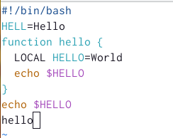
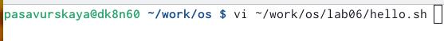

---
## Front matter
lang: ru-RU
title: Лабораторная работа №8
subtitle: Операционные системы
author:
  - Савурская П. А.
institute:
  - Российский университет дружбы народов, Москва, Россия
date: 16 марта 2023

## i18n babel
babel-lang: russian
babel-otherlangs: english

## Formatting pdf
toc: false
toc-title: Содержание
slide_level: 2
aspectratio: 169
section-titles: true
theme: metropolis
header-includes:
 - \metroset{progressbar=frametitle,sectionpage=progressbar,numbering=fraction}
 - '\makeatletter'
 - '\beamer@ignorenonframefalse'
 - '\makeatother'
---

## Докладчик

  * Савурская Полина Александровна
  * Российский университет дружбы народов
  * №студ.билета 1132222827

## Цель работы.

Познакомиться с операционной системой Linux. Получить практические навыки работы с редактором vi, установленным по умолчанию практически во всех дистрибутивах.

## Задание 1. Создание нового файла с использованием vi

1. Создаю каталог с именем ~/work/os/lab06. 

2. Перехожу во вновь созданный каталог. 

3. Вызываю vi и создаю файл hello.sh командой vi hello.sh

4. Нажимаю клавишу i и ввожу следующий текст.

!/bin/bash
HELL=Hello function hello {
  LOCAL HELLO=World
echo $HELLO }
echo $HELLO
hello

5. Нажимаю клавишу Esc для перехода в командный режим после завершения ввода текста.

6. Нажимаю : для перехода в режим последней строки и внизу экрана появится приглашение в виде двоеточия.

7. Нажимаю w (записать) и q (выйти), а затем клавишу Enter для сохранения текста и завершения работы.

8. Сделаю файл исполняемым командой chmod +x hello.sh

## Задание 2. Редактирование существующего файла

1. Вызываю vi на редактирование файла командой vi ~/work/os/lab06/hello.sh

2. Устанавливаю курсор в конец слова HELL второй строки. 

3. Перехожу в режим вставки и заменяю на HELLO. Нажимаю Esc для возврата в командный режим.

4. Устанавливаю курсор на четвертую строку и стираю слово LOCAL.
 
5. Перехожу в режим вставки и набираю следующий текст: local, нажимаю Esc для возврата в командный режим.

6. Установливаю курсор на последней строке файла. Вставляю после неё строку, содержащую следующий текст:echo $HELLO.

7. Нажимаю Esc для перехода в командный режим.

8. Удаляю последнюю строку.

9. Ввожу команду отмены изменений u для отмены последней команды.

10. Ввожу символ : для перехода в режим последней строки. Запишу произведённые изменения и выхожу из vi.

## Выполнение лабораторной работы. Шаг 1.

Создаю каталог с именем ~/work/os/lab06. Перехожу в него.

## Выполнение лабораторной работы. Шаг 2.

Вызываю vi и создаю файл hello.sh командой vi hello.sh

{#fig:001 width=70%}

## Выполнение лабораторной работы. Шаг 3.

Ввожу данный текст.

{#fig:002 width=70%}

## Выполнение лабораторной работы. Шаг 4.

Вношу в файл все изменения по методичке и делаю этот файл исполняемым командой chmod +x hello.sh

{#fig:003 width=70%}

## Выполнение лабораторной работы. Шаг 5.

Вызываю vi на редактирование файла командой vi ~/work/os/lab06/hello.sh. После делаю все изменения по методичке и выхожу.

{#fig:004 width=70%}

## Вывод.

Я ознакомилась с операционной системой Linux. Получила практические навыки работы с редактором vi, установленным по умолчанию практически во всех дистрибутивах.
