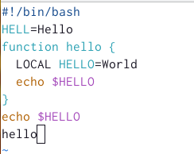
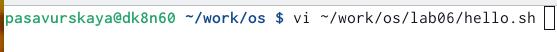

---
## Front matter
title: "Лабораторная работа №8"
subtitle: "Операционные системы"
author: "Савурская Полина"

## Generic otions
lang: ru-RU
toc-title: "Содержание"

## Bibliography
bibliography: bib/cite.bib
csl: pandoc/csl/gost-r-7-0-5-2008-numeric.csl

## Pdf output format
toc: true # Table of contents
toc-depth: 2
lof: true # List of figures
fontsize: 12pt
linestretch: 1.5
papersize: a4
documentclass: scrreprt
## I18n polyglossia
polyglossia-lang:
  name: russian
  options:
	- spelling=modern
	- babelshorthands=true
polyglossia-otherlangs:
  name: english
## I18n babel
babel-lang: russian
babel-otherlangs: english
## Fonts
mainfont: PT Serif
romanfont: PT Serif
sansfont: PT Sans
monofont: PT Mono
mainfontoptions: Ligatures=TeX
romanfontoptions: Ligatures=TeX
sansfontoptions: Ligatures=TeX,Scale=MatchLowercase
monofontoptions: Scale=MatchLowercase,Scale=0.9
## Biblatex
biblatex: true
biblio-style: "gost-numeric"
biblatexoptions:
  - parentracker=true
  - backend=biber
  - hyperref=auto
  - language=auto
  - autolang=other*
  - citestyle=gost-numeric
## Pandoc-crossref LaTeX customization
figureTitle: "Рис."
listingTitle: "Листинг"
lofTitle: "Список иллюстраций"
lolTitle: "Листинги"
## Misc options
indent: true
header-includes:
  - \usepackage{indentfirst}
  - \usepackage{float} # keep figures where there are in the text
  - \floatplacement{figure}{H} # keep figures where there are in the text
---

# Цель работы

Познакомиться с операционной системой Linux. Получить практические навыки работы с редактором vi, установленным по умолчанию практически во всех дистрибутивах.

# Задание 1. Создание нового файла с использованием vi

1. Создаю каталог с именем ~/work/os/lab06. 

2. Перехожу во вновь созданный каталог. 

3. Вызываю vi и создаю файл hello.sh командой vi hello.sh

4. Нажимаю клавишу i и ввожу следующий текст.

!/bin/bash
HELL=Hello function hello {
  LOCAL HELLO=World
echo $HELLO }
echo $HELLO
hello

5. Нажимаю клавишу Esc для перехода в командный режим после завершения ввода текста.

6. Нажимаю : для перехода в режим последней строки и внизу экрана появится приглашение в виде двоеточия.

7. Нажимаю w (записать) и q (выйти), а затем клавишу Enter для сохранения текста и завершения работы.

8. Сделаю файл исполняемым командой chmod +x hello.sh

# Задание 2. Редактирование существующего файла

1. Вызываю vi на редактирование файла командой vi ~/work/os/lab06/hello.sh

2. Устанавливаю курсор в конец слова HELL второй строки. 

3. Перехожу в режим вставки и заменяю на HELLO. Нажимаю Esc для возврата в командный режим.

4. Устанавливаю курсор на четвертую строку и стираю слово LOCAL.
 
5. Перехожу в режим вставки и набираю следующий текст: local, нажимаю Esc для возврата в командный режим.

6. Установливаю курсор на последней строке файла. Вставляю после неё строку, содержащую следующий текст:echo $HELLO.

7. Нажимаю Esc для перехода в командный режим.

8. Удаляю последнюю строку.

9. Ввожу команду отмены изменений u для отмены последней команды.

10. Ввожу символ : для перехода в режим последней строки. Запишу произведённые изменения и выхожу из vi.

# Выполнение лабораторной работы

1. Создаю каталог с именем ~/work/os/lab06. Перехожу в него.

2. Вызываю vi и создаю файл hello.sh командой vi hello.sh

{#fig:001 width=70%}

3. Ввожу данный текст.

{#fig:002 width=70%}

4. Вношу в файл все изменения по методичке и делаю этот файл исполняемым командой chmod +x hello.sh

{#fig:003 width=70%}

5. Вызываю vi на редактирование файла командой vi ~/work/os/lab06/hello.sh. После делаю все изменения по методичке и выхожу.

{#fig:004 width=70%}

# Выводы

Я ознакомилась с операционной системой Linux. Получила практические навыки работы с редактором vi, установленным по умолчанию практически во всех дистрибутивах.
