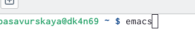
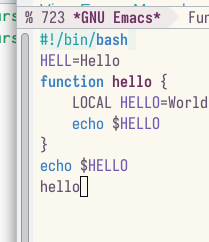
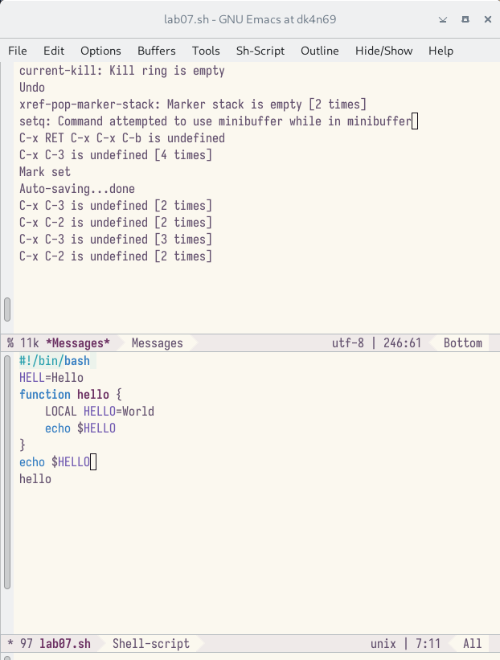
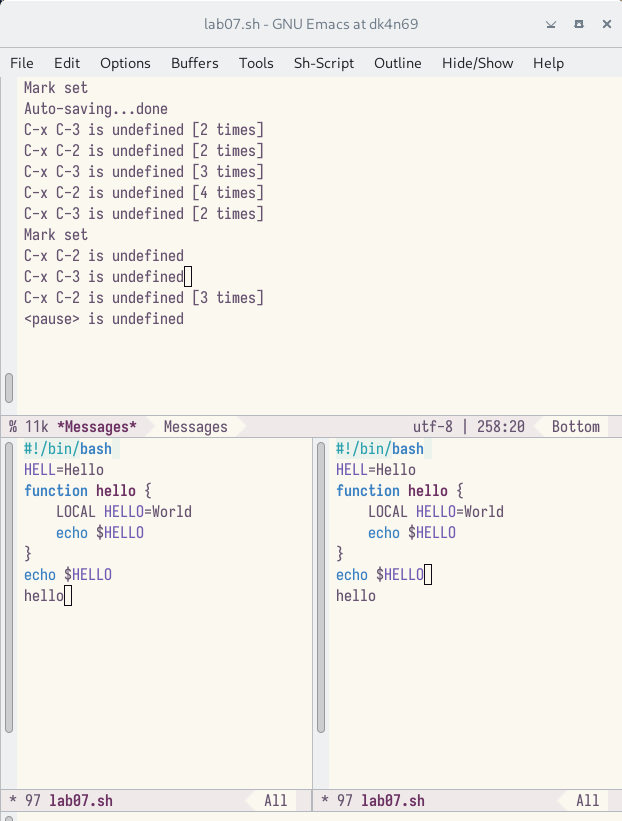
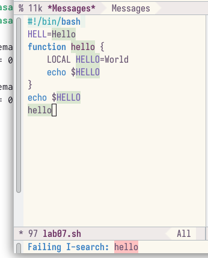

---
## Front matter
title: "Лабораторная работа №9"
subtitle: "Операционные системы"
author: "Савурская Полина"

## Generic otions
lang: ru-RU
toc-title: "Содержание"

## Bibliography
bibliography: bib/cite.bib
csl: pandoc/csl/gost-r-7-0-5-2008-numeric.csl

## Pdf output format
toc: true # Table of contents
toc-depth: 2
lof: true # List of figures
fontsize: 12pt
linestretch: 1.5
papersize: a4
documentclass: scrreprt
## I18n polyglossia
polyglossia-lang:
  name: russian
  options:
	- spelling=modern
	- babelshorthands=true
polyglossia-otherlangs:
  name: english
## I18n babel
babel-lang: russian
babel-otherlangs: english
## Fonts
mainfont: PT Serif
romanfont: PT Serif
sansfont: PT Sans
monofont: PT Mono
mainfontoptions: Ligatures=TeX
romanfontoptions: Ligatures=TeX
sansfontoptions: Ligatures=TeX,Scale=MatchLowercase
monofontoptions: Scale=MatchLowercase,Scale=0.9
## Biblatex
biblatex: true
biblio-style: "gost-numeric"
biblatexoptions:
  - parentracker=true
  - backend=biber
  - hyperref=auto
  - language=auto
  - autolang=other*
  - citestyle=gost-numeric
## Pandoc-crossref LaTeX customization
figureTitle: "Рис."
listingTitle: "Листинг"
lofTitle: "Список иллюстраций"
lotTitle: "Список таблиц"
lolTitle: "Листинги"
## Misc options
indent: true
header-includes:
  - \usepackage{indentfirst}
  - \usepackage{float} # keep figures where there are in the text
  - \floatplacement{figure}{H} # keep figures where there are in the text
---

# Цель работы

Познакомиться с операционной системой Linux. Получить практические навыки работы с редактором Emacs.

# Задание

1. Ознакомиться с теоретическим материалом. 

2. Ознакомиться с редактором emacs.

3. Выполнить упражнения.

4. Ответить на контрольные вопросы.

# Контрольные вопросы

1. Кратко охарактеризуйте редактор emacs.

2. Какие особенности данного редактора могут сделать его сложным для освоения новичком?

3. Своими словами опишите,что такое буфер и окно в терминологии emacs’а.

4. Можно ли открыть больше 10 буферов в одном окне?

5. Какие буферы создаются по умолчанию при запуске emacs?

6. Какие клавиши вы нажмёте,чтобы ввести следующую комбинацию C-c| и C-c C-|?

7. Как поделить текущее окно на две части?

8. В каком файле хранятся настройки редактора emacs?

9. Какую функцию выполняет клавиша <- и можно ли её переназначить?

10. Какой редактор вам показался удобнее в работе vi или emacs? Поясните почему.

# Выполнение лабораторной работы

1. Открываю emacs.

{#fig:001 width=70%}

2. Создаю файл lab07.sh с помощью комбинации C-x C-f и набираю текст:

{#fig:002 width=70%}

3. Проделываю с текстом стандартные процедуры редактирования с помощью комбинаций клавиш строго по методичке.

4. Делю окно по вертикали на 2.

{#fig:003 width=70%}

5. Делю нижнее окно на 2 по горизонтали.

{#fig:004 width=70%}

6. Активирую режим поиска (ищу слово hello)

{#fig:005 width=70%}

# Выводы

Я познакомилась с операционной системой Linux. Получила практические навыки работы с редактором Emacs.

# Ответы на контрольные вопросы

1. Emacs представляет собой мощный экранный редактор текста, написанный на языке высокого уровня Elisp.

2. Развитие Emacs в сторону его многогранности послужило причиной того, что и без того интуитивно непонятная программа стала чрезвычайно сложной в применении. В частности, управление осуществляется при помощи различных клавиатурных комбинаций, запомнить которые будет непросто.

3. Буфер – что-то, состоящее из текста. Окно – область с одним из буферов.

4. В одном окне можно открыть больше 10 буферов.

5. После запуска emacs без каких-либо параметров в основном окне отображается буфер scratch, который используется для оценки выражений Emacs Lisp, а также для заметок, которые вы не хотите сохранять. Этот буфер не сохраняется автоматически.

6. Чтобы ввести следующую комбинацию C-c | я нажму клавиши: Control+c и Shift+, и для C-c C-|: Control+c и Control+Shift+.

7. Поделить текущее окно на две части можно двумя комбинациями клавиш: C-x 3 или C-x 2.

8. Настроить или расширить Emacs можно написав или изменив файл ~/.emacs.

9. Клавиша выполняет функцию перемещения курсора в открытом окне также, как и многие другие клавиши её можно переназначить.

10. Редактор emacs показался мне удобнее из-за возможности открытия нескольких окон с буферами и работать комбинациями клавиш в этот редакторе мне было проще.

