---
## Front matter
lang: ru-RU
title: Лабораторная работа №9
subtitle: Операционные системы
author:
  - Савурская П.А.
institute:
  - Российский университет дружбы народов, Москва, Россия
date: 07 апреля 2023

## i18n babel
babel-lang: russian
babel-otherlangs: english

## Formatting pdf
toc: false
toc-title: Содержание
slide_level: 2
aspectratio: 169
section-titles: true
theme: metropolis
header-includes:
 - \metroset{progressbar=frametitle,sectionpage=progressbar,numbering=fraction}
 - '\makeatletter'
 - '\beamer@ignorenonframefalse'
 - '\makeatother'
---

## Докладчик

  * Савурская полина Александровна
  * НБИбд-04-22
  * №студ.билета 1132222827
  * Российский университет дружбы народов

## Цель работы

Изучить основы программирования в оболочке ОС UNIX/Linux. Научиться писать небольшие командные файлы.

## Задание

1. Написать скрипт, который при запуске будет делать резервную копию самого себя(то есть файла, в котором содержится его исходный код) в другую директорию backup в вашем домашнем каталоге. При этом файл должен архивироваться одним из ариваторов на выбор zip, bzip2 или tar. Способ использования команд архивации необходимо узнать, изучив справку.

2. Написать пример командного файла,обрабатывающего любое произвольное число аргументов командной строки, в том числе превышающее десять. Например, скрипт может последовательно распечатывать значения всех переданных аргументов.

3. Написать командный файл—аналог команды ls(без использования самой этой команды и команды dir). Требуется, чтобы он выдавал информацию о нужном каталоге и выводил информацию о возможностях доступа к файлам этого каталога.

4. Написать командный файл, который получает в качестве аргумента командной строки формат файла (.txt, .doc, .jpg, .pdf и т.д.) и вычисляет количество таких файлов в указанной директории. Путь к директории также передаётся в виде аргумента командной строки.

## Выполнение лабораторной работы. Шаг 1.

Изучаем справку о команде tar. Создаем файл script.sh. Задаем ему необходимые разрешения. Проверяем, появился ли у нас этот файл.

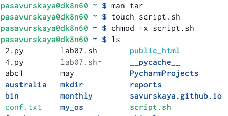{#fig:001 width=70%}

## Выполнение лабораторной работы. Шаг 2.

Открываем этот файл и пишем там нужный код.

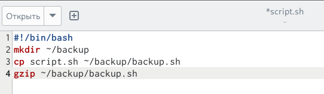{#fig:002 width=70%}

## Выполнение лабораторной работы. Шаг 3.

В домашней директории появляется папка backup. Внутри нее лежит заархивированный файл.

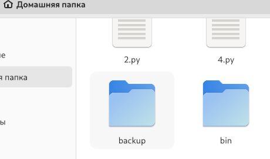{#fig:003 width=50%}

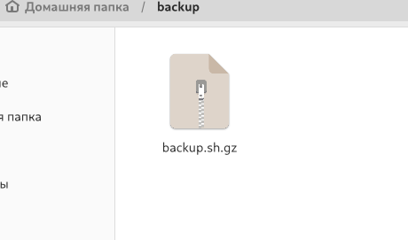{#fig:004 width=50%}

## Выполнение лабораторной работы. Шаг 4.

Создаем файл script2.sh. Задаем ему необходимые разрешения. Проверяем, появился ли у нас этот файл.

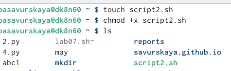{#fig:005 width=70%}

## Выполнение лабораторной работы. Шаг 5.

Открываем этот файл и пишем там нужный код.

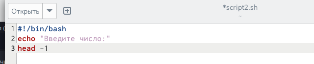{#fig:006 width=70%}

## Выполнение лабораторной работы. Шаг 6.

Запускаем файл script2.sh и вводим числа. Они выводятся в таком же порядке. Все сделано правильно.

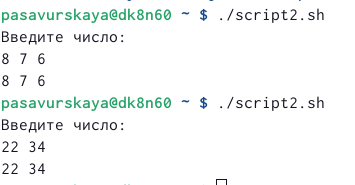{#fig:007 width=70%}

## Выполнение лабораторной работы. Шаг 7.

Создаем файл script3.sh. Задаем ему необходимые разрешения. Проверяем, появился ли у нас этот файл.

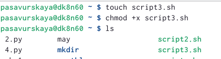{#fig:008 width=70%}

## Выполнение лабораторной работы. Шаг 8.

Открываем этот файл и пишем там нужный код.

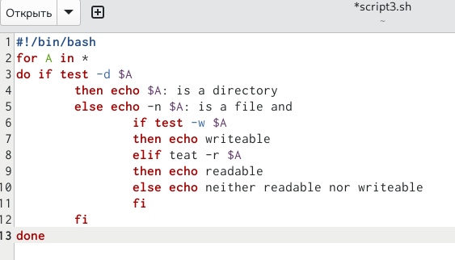{#fig:009 width=70%}

## Выполнение лабораторной работы. Шаг 9.

Запускаем файл script3.sh. Он выдает информацию о нужном каталоге и выводит информацию о возможностях доступа к файлам этого каталога.

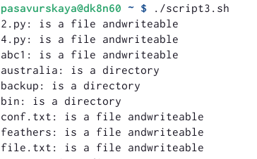{#fig:010 width=70%}

## Выполнение лабораторной работы. Шаг 10.

Создаем файл script4.sh. Задаем ему необходимые разрешения. Проверяем, появился ли у нас этот файл.

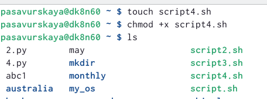{#fig:011 width=70%}

## Выполнение лабораторной работы. Шаг 11.

Открываем этот файл и пишем там нужный код.

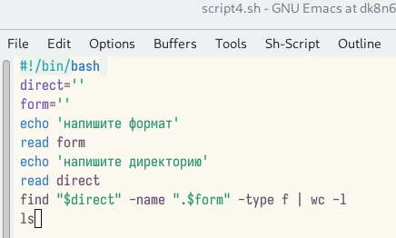{#fig:012 width=70%}

## Выполнение лабораторной работы. Шаг 12.

Запускаем файл script4.sh. Он получает в качестве аргумента командной строки формат файла (.txt, .doc, .jpg, .pdf и т.д.) и вычисляет количество таких файлов в указанной директории.

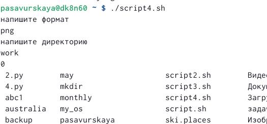{#fig:013 width=70%}

## Выводы

Я изучила основы программирования в оболочке ОС UNIX/Linux. Научилась писать небольшие командные файлы.
