---
## Front matter
lang: ru-RU
title: Лабораторная работа №11
subtitle: Операционные системы
author:
  - Савурская П.А.
institute:
  - Российский университет дружбы народов, Москва, Россия
date: 19 апреля 2023

## i18n babel
babel-lang: russian
babel-otherlangs: english

## Formatting pdf
toc: false
toc-title: Содержание
slide_level: 2
aspectratio: 169
section-titles: true
theme: metropolis
header-includes:
 - \metroset{progressbar=frametitle,sectionpage=progressbar,numbering=fraction}
 - '\makeatletter'
 - '\beamer@ignorenonframefalse'
 - '\makeatother'
---

## Докладчик

  * Савурская полина Александровна
  * НБИбд-04-22
  * №студ.билета 1132222827
  * Российский университет дружбы народов

## Цель работы

Изучить основы программирования в оболочке ОС UNIX. Научится писать более сложные командные файлы с использованием логических управляющих конструкций и циклов.

## Задание

1. Используя команды getopts grep, написать командный файл, который анализирует командную строку с ключами:
– -iinputfile—прочитать данные из указанного файла;

– -ooutputfile—вывести данные в указанный файл;

– -p шаблон—указать шаблон для поиска;

– -C—различать большие и малые буквы;

– -n—выдавать номера строк.

а затем ищет в указанном файле нужные строки, определяемые ключом -p.

2. Написать на языке Си программу, которая вводит число и определяет, является ли оно больше нуля, меньше нуля или равно нулю. Затем программа завершается с помощью функции exit(n), передавая информацию в о коде завершения в оболочку. Командный файл должен вызывать эту программу и, проанализировав с помощью команды $?, выдать сообщение о том, какое число было введено.

3. Написать командный файл, создающий указанное число файлов, пронумерованных последовательно от 1 до 𝑁 (например 1.tmp, 2.tmp, 3.tmp,4.tmp и т.д.). Число файлов, которые необходимо создать, передаётся в аргументы командной строки. Этот же командный файл должен уметь удалять все созданные им файлы (если они существуют).

4. Написать командный файл , который с помощью команды tar запаковывает в архив все файлы в указанной директории. Модифицировать его так, чтобы запаковывались только те файлы, которые были изменены менее недели тому назад (использовать команду find).

## Выполнение лабораторной работы. Шаг 1.

Создаем файлы file1.sh и file1.txt. Задаем им необходимые разрешения. Проверяем, появилисьли у нас эти файлы.

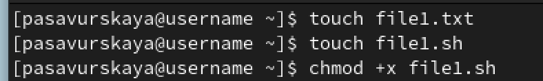{#fig:001 width=70%}

## Выполнение лабораторной работы. Шаг 2.

В файле file1.txt пишем текст, который будет выводится на экран. В файле file1.sh пишем код.

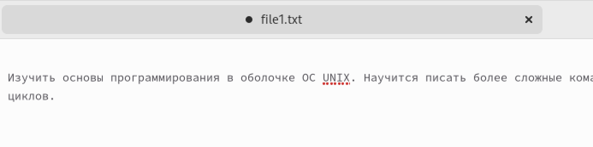{#fig:002 width=50%}

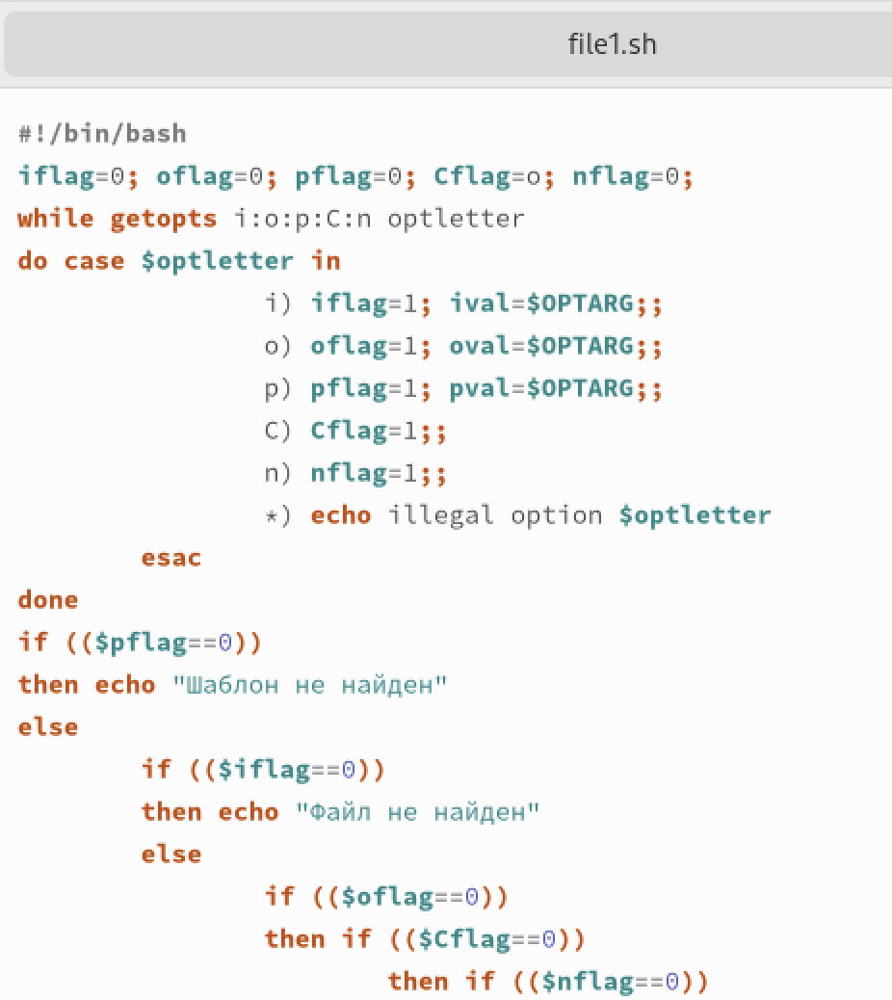{#fig:003 width=50%}

## Выполнение лабораторной работы. Шаг 3.

Задаем файлам необходимые конфигурации и запускаем.

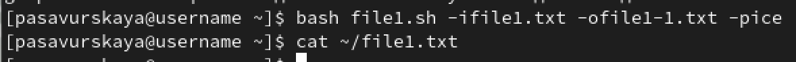{#fig:004 width=70%}

## Выполнение лабораторной работы. Шаг 4.

Создаем файлы file2.sh и file2.с. Задаем им необходимые разрешения.

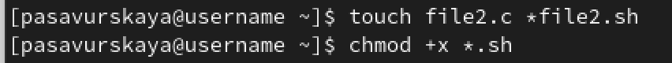{#fig:005 width=70%}

## Выполнение лабораторной работы. Шаг 5.

Открываем эти файлы и пишем там нужные коды.

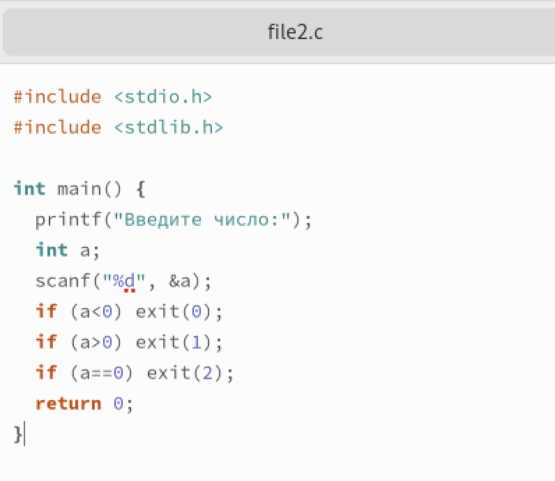{#fig:006 width=50%}

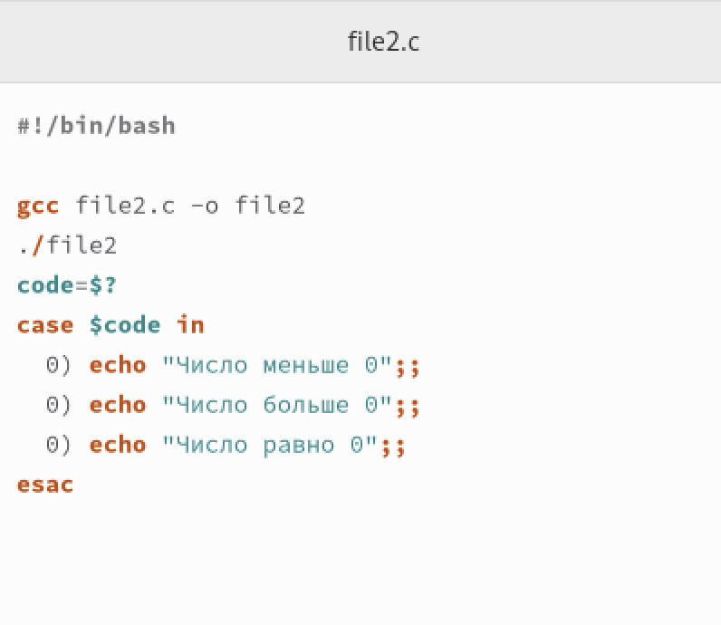{#fig:007 width=50%}

## Выполнение лабораторной работы. Шаг 6.

Запускаем файл file2.sh и вводим числа. Они выводятся с пояснением относительно нуля. Все сделано правильно.

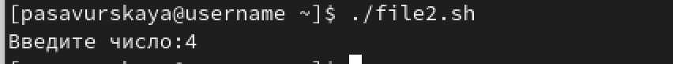{#fig:008 width=70%}

## Выполнение лабораторной работы. Шаг 7.

Создаем файл file3.sh. Задаем ему необходимые разрешения. Проверяем, появился ли у нас этот файл.

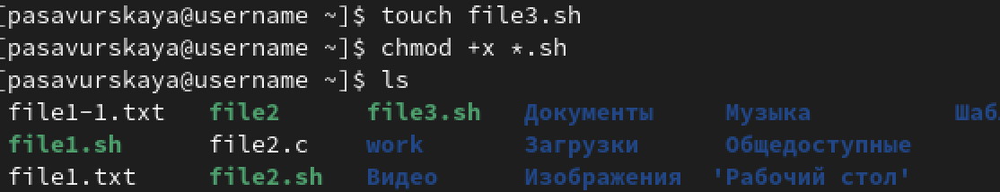{#fig:009 width=70%}

## Выполнение лабораторной работы. Шаг 8.

Открываем этот файл и пишем там нужный код.

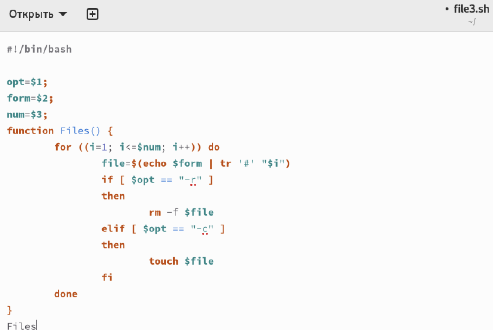{#fig:010 width=70%}

## Выполнение лабораторной работы. Шаг 9.

Запускаем файл file3.sh. Он создает указанное число файлов, пронумерованных последовательно от 1 до 𝑁 (например 1.tmp, 2.tmp, 3.tmp,4.tmp и т.д.). Число файлов, которые необходимо создать, передаётся в аргументы командной строки. Этот же файл удаляет все созданные им файлы.

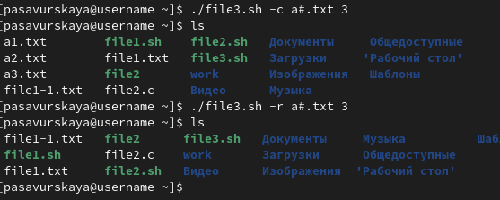{#fig:011 width=70%}

## Выполнение лабораторной работы. Шаг 10.

Создаем файл file4.sh. 

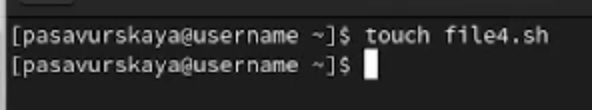{#fig:012 width=70%}

## Выполнение лабораторной работы. Шаг 11.

Открываем этот файл и пишем там нужный код.

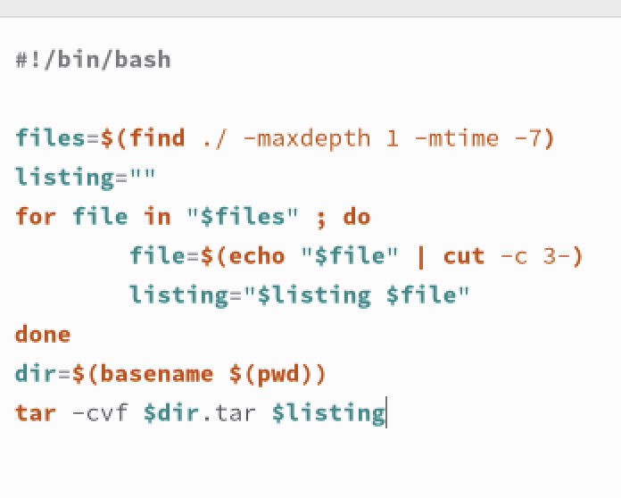{#fig:013 width=70%}

## Выполнение лабораторной работы. Шаг 12.

Запускаем файл file4.sh.

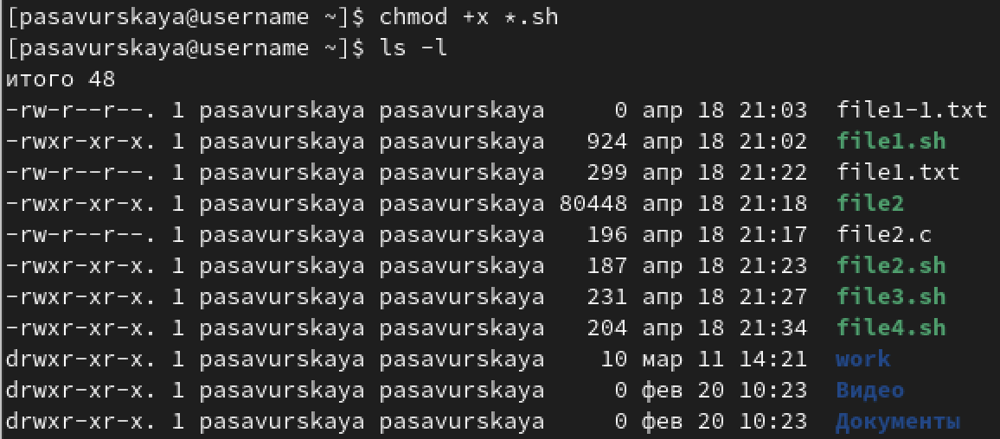{#fig:014 width=70%}

## Выводы

Я изучила основы программирования в оболочке ОС UNIX. Научилась писать более сложные командные файлы с использованием логических управляющих конструкций и циклов.
