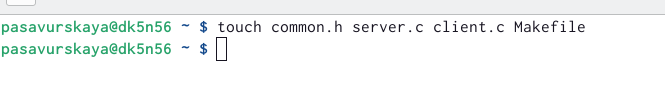
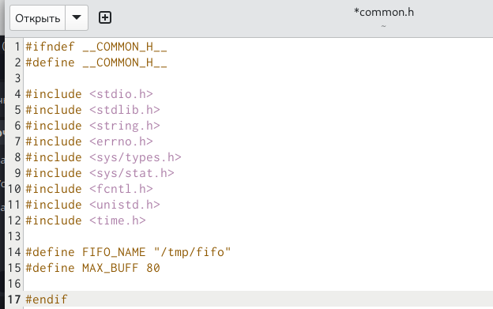
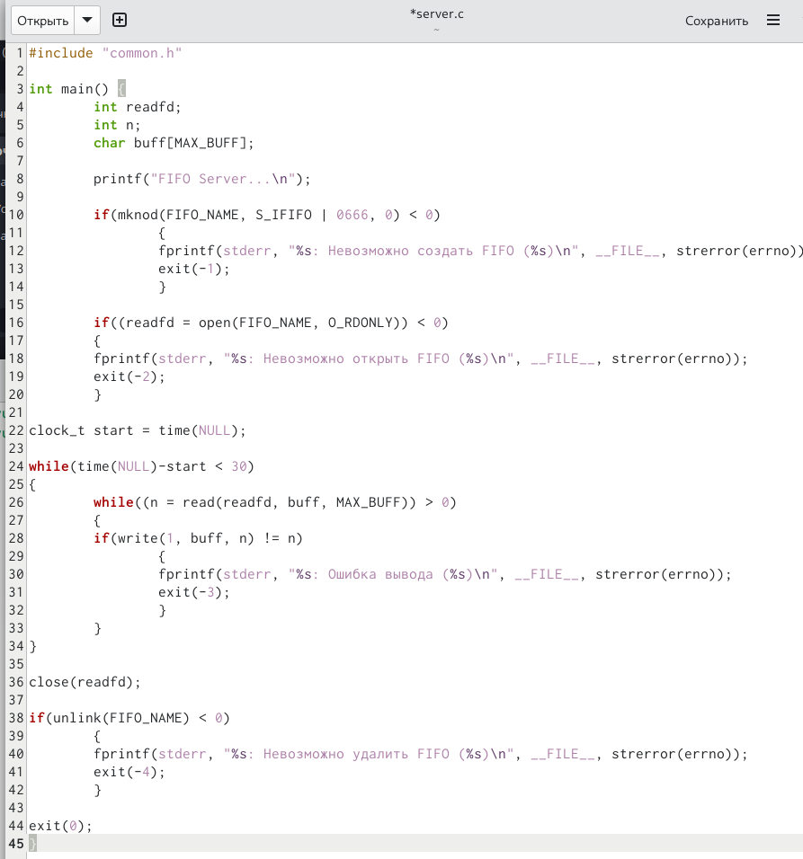
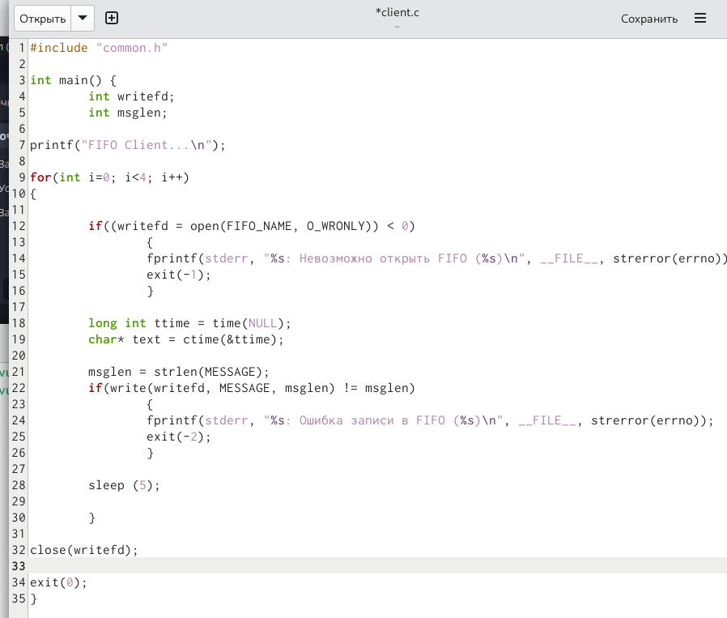
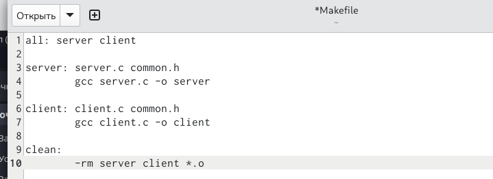
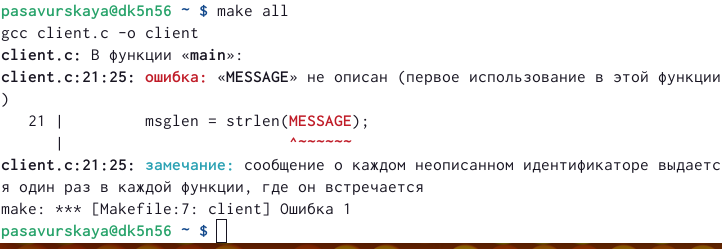
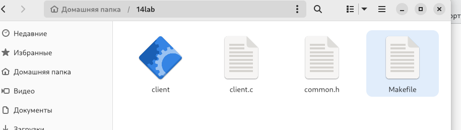
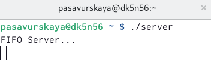

---
## Front matter
lang: ru-RU
title: Лабораторная работа №14
subtitle: Операционные системы
author:
  - Савурская П.А.
institute:
  - Российский университет дружбы народов, Москва, Россия
date: 26 апреля 2023

## i18n babel
babel-lang: russian
babel-otherlangs: english

## Formatting pdf
toc: false
toc-title: Содержание
slide_level: 2
aspectratio: 169
section-titles: true
theme: metropolis
header-includes:
 - \metroset{progressbar=frametitle,sectionpage=progressbar,numbering=fraction}
 - '\makeatletter'
 - '\beamer@ignorenonframefalse'
 - '\makeatother'
---

## Докладчик

  * Савурская Полина
  * 1132222827
  * НБИбд-04-22
  * Российский университет дружбы народов

## Цель работы.

Приобретение практических навыков работы с именованными каналами.

## Задание.

Изучите приведённые в тексте программы server.c и client.c. Взяв данные примеры за образец, напишите аналогичные программы, внеся следующие изменения:

1. Работает не 1 клиент, а несколько (например, два).

2. Клиенты передают текущее время с некоторой периодичностью (например, раз в пять секунд). Используйте функцию sleep() для приостановки работы клиента.

3. Сервер работает не бесконечно, а прекращает работу через некоторое время (например, 30 сек). Используйте функцию clock() для определения времени работы сервера. Что будет в случае, если сервер завершит работу, не закрыв канал?

## Выполнение лабораторной работы. Шаг 1.

Создаю файлы common.h, server.c, client.c, makefile

{#fig:001 width=70%}

## Выполнение лабораторной работы. Шаг 2.

Изменяю файл common.h

{#fig:002 width=50%}

## Выполнение лабораторной работы. Шаг 3.

Изменяю файл server.c

{#fig:003 width=50%}

## Выполнение лабораторной работы. Шаг 4.

Изменяю файл client.c

{#fig:004 width=50%}

## Выполнение лабораторной работы. Шаг 5.

Изменяю файл makefile

{#fig:005 width=50%}

## Выполнение лабораторной работы. Шаг 6.

В терминале пишем make all.

{#fig:006 width=50%}

## Выполнение лабораторной работы. Шаг 7.

Появляется исполняемый файл client

{#fig:007 width=50%}

## Выполнение лабораторной работы. Шаг 8.

Пишем ./server 

{#fig:008 width=50%}

## Выводы.

Я приобрела практические навыки работы с именованными каналами.
