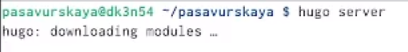

---
## Front matter
lang: ru-RU
title: Индивидуальный проект. Этап 2
subtitle: Операционные системы
author:
  - Савурская П. А., №студ.билета 1132222827
institute:
  - Российский университет дружбы народов, Москва, Россия
date: 03 марта 2023

## i18n babel
babel-lang: russian
babel-otherlangs: english

## Formatting pdf
toc: false
toc-title: Содержание
slide_level: 2
aspectratio: 169
section-titles: true
theme: metropolis
header-includes:
 - \metroset{progressbar=frametitle,sectionpage=progressbar,numbering=fraction}
 - '\makeatletter'
 - '\beamer@ignorenonframefalse'
 - '\makeatother'
---

## Цель работы

Цель второго этапа - заполнить на своем сайте данные об авторе, и написать два поста.

## Задание

1)Добавить к сайту данные о себе.
Список добавляемых данных:
       - Разместить фотографию владельца сайта.
       - Разместить краткое описание владельца сайта (Biography).
       - Добавить информацию об интересах (Interests).
       - Добавить информацию от образовании (Education).
2)Сделать пост по прошедшей неделе.Добавить пост на тему по выбору:
       - Управление версиями. Git.
       - Непрерывная интеграция и непрерывное развертывание (CI/CD).

## Выполнение лабораторной работы. Шаг 1.

В терминале пишем команду hugo server. 

{#fig:001 width=70%}

## Выполнение лабораторной работы. Шаг 2.

В терминале появляется ссылка на сайт, ее надо скопировать и вставить в браузер.

{#fig:002 width=70%}

## Выполнение лабораторной работы. Шаг 3.

В домашней папке находим папку для сайта, там переходим в папку content, далее в папку authors, и в папке admin меняем исходное фото на свое, сохраняя прежнее имя. И в документе _index.md меняем нужные параметры, сверяясь с сайтом.

{#fig:003 width=70%}

## Выполнение лабораторной работы. Шаг 4.

Чтобы сделать новый пост,в домашней папке находим папку для сайта, там переходим в папку content, далее в папку post, и в нужной папке меняем фото и вносим изменения в файл markdown.

{#fig:004 width=70%}

## Выполнение лабораторной работы. Шаг 5.

В терминале пишем команду hugo, чтобы начать сохранять изменения на сайте.

{#fig:005 width=70%}

## Выполнение лабораторной работы. Шаг 6.

Через команду git status смотрим, что мы изменили на сайте.

{#fig:006 width=70%}

## Выполнение лабораторной работы. Шаг 7.

С помощью команд git commit и git push отправляем измененные данные.

{#fig:007 width=70%}

## Выполнение лабораторной работы. Шаг 8.

Переходим в папку public и вводим там команду git status.

{#fig:008 width=70%}

## Выполнение лабораторной работы. Шаг 9.

Командами git add, git commit, git push отправляем данные на сайт, чтобы они там сохранились.

{#fig:009 width=50%}

{#fig:010 width=50%}

## Выводы

Я заполнила на сайте данные о себе и сделала два поста.
