---
## Front matter
lang: ru-RU
title: Индивидуальный проект. Этап 3
subtitle: Операционные системы
author:
  - Савурская П. А., №студ.билета 1132222827
institute:
  - Российский университет дружбы народов, Москва, Россия
date: 06 марта 2023

## i18n babel
babel-lang: russian
babel-otherlangs: english

## Formatting pdf
toc: false
toc-title: Содержание
slide_level: 2
aspectratio: 169
section-titles: true
theme: metropolis
header-includes:
 - \metroset{progressbar=frametitle,sectionpage=progressbar,numbering=fraction}
 - '\makeatletter'
 - '\beamer@ignorenonframefalse'
 - '\makeatother'
---

## Цель работы.

Цель третьего этапа - добавить на сайт информацию о навыках, опыте, достижениях, и написать два поста.

## Задание.

1)Добавить к сайту достижения. Список достижений:

  -Добавить информацию о навыках (Skills).
  -Добавить информацию об опыте (Experience).
  -Добавить информацию о достижениях (Accomplishments).
  
2)Сделать пост по прошедшей неделе.

3)Добавить пост на тему по выбору:

  -Легковесные языки разметки.
  -Языки разметки. LaTeX.
  -Язык разметки Markdown.

## Выполнение лабораторной работы. Шаг 1.

В терминале пишем команду hugo server. В терминале появляется ссылка на сайт, ее надо скопировать и вставить в браузер.

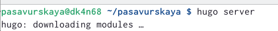{#fig:001 width=70%}

## Выполнение лабораторной работы. Шаг 2.

В домашней папке находим папку для сайта, там переходим в папку content, далее в документ _index.md. Там меняем нужные параметры, сверяясь с сайтом.

## Выполнение лабораторной работы. Шаг 3.

Меняем Skills.

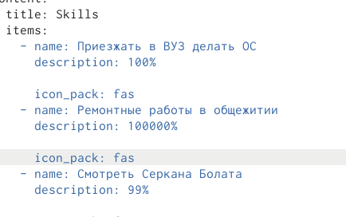{#fig:002 width=70%}

## Выполнение лабораторной работы. Шаг 4.

Меняем Experience.

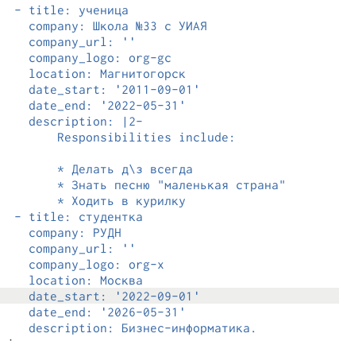{#fig:003 width=70%}

## Выполнение лабораторной работы. Шаг 5.

Меняем Accomplishments.

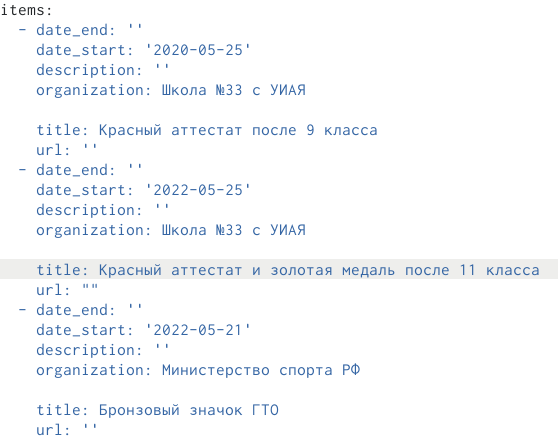{#fig:004 width=70%}

## Выполнение лабораторной работы. Шаг 6.

Чтобы сделать новый пост,в домашней папке находим папку для сайта, там переходим в папку content, далее в папку post, и в нужной папке меняем фото и вносим изменения в файл markdown. Пост на тему по выбору будет у меня про Markdown.

## Выполнение лабораторной работы. Шаг 7.

В терминале пишем команду hugo, чтобы начать сохранять изменения на сайте.

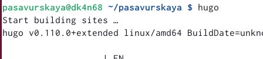{#fig:005 width=70%}

## Выполнение лабораторной работы. Шаг 8.

С помощью команд git add, git commit, git push отправляем измененные данные.

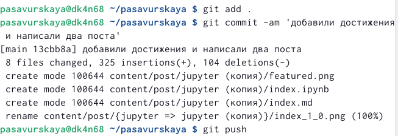{#fig:006 width=70%}

## Выполнение лабораторной работы. Шаг 9.

Переходим в папку public и вводим там команды git.

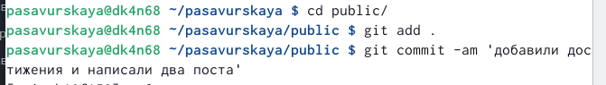{#fig:007 width=50%}

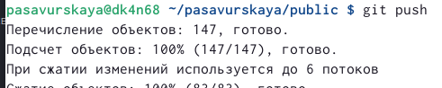{#fig:008 width=50%}

## Выполнение лабораторной работы. Шаг 10.

Готовые Skills.

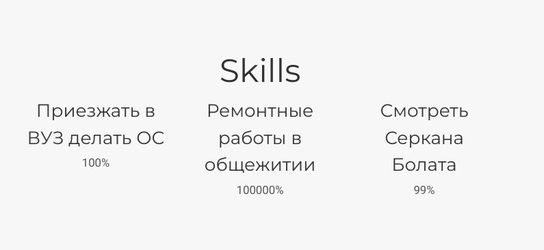{#fig:009 width=70%}

## Выполнение лабораторной работы. Шаг 11.

Готовые Experience.

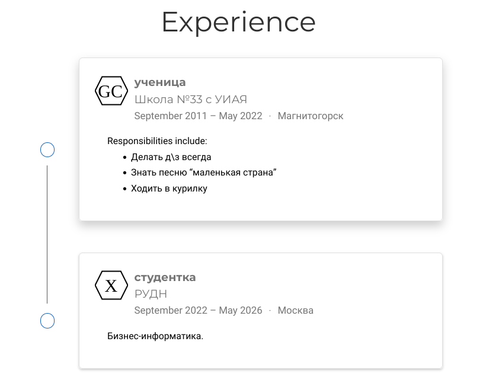{#fig:010 width=70%}

## Выполнение лабораторной работы. Шаг 12.

Готовые Accomplishments.

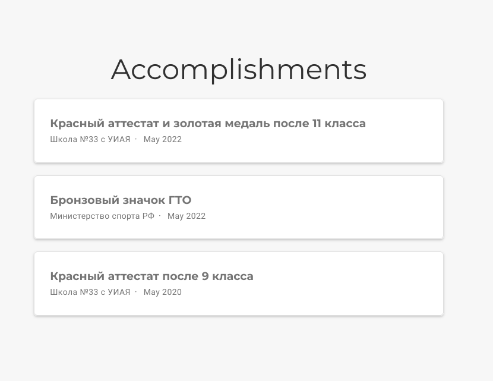{#fig:011 width=70%}

## Выполнение лабораторной работы. Шаг 13.

Готовые посты.

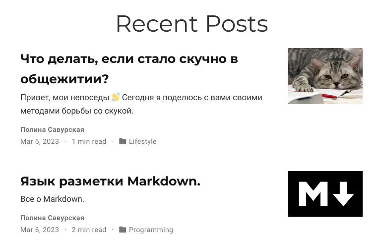{#fig:012 width=70%}

## Выводы

Я заполнила на сайте информацию о навыках, опыте, достижениях, и написала два поста.
