---
## Front matter
title: "Индивидуальный проект. Этап 3"
subtitle: "Операционные системы"
author: "Савурская Полина"

## Generic otions
lang: ru-RU
toc-title: "Содержание"

## Bibliography
bibliography: bib/cite.bib
csl: pandoc/csl/gost-r-7-0-5-2008-numeric.csl

## Pdf output format
toc: true # Table of contents
toc-depth: 2
lof: true # List of figures
fontsize: 12pt
linestretch: 1.5
papersize: a4
documentclass: scrreprt
## I18n polyglossia
polyglossia-lang:
  name: russian
  options:
	- spelling=modern
	- babelshorthands=true
polyglossia-otherlangs:
  name: english
## I18n babel
babel-lang: russian
babel-otherlangs: english
## Fonts
mainfont: PT Serif
romanfont: PT Serif
sansfont: PT Sans
monofont: PT Mono
mainfontoptions: Ligatures=TeX
romanfontoptions: Ligatures=TeX
sansfontoptions: Ligatures=TeX,Scale=MatchLowercase
monofontoptions: Scale=MatchLowercase,Scale=0.9
## Biblatex
biblatex: true
biblio-style: "gost-numeric"
biblatexoptions:
  - parentracker=true
  - backend=biber
  - hyperref=auto
  - language=auto
  - autolang=other*
  - citestyle=gost-numeric
## Pandoc-crossref LaTeX customization
figureTitle: "Рис."
listingTitle: "Листинг"
lofTitle: "Список иллюстраций"
lolTitle: "Листинги"
## Misc options
indent: true
header-includes:
  - \usepackage{indentfirst}
  - \usepackage{float} # keep figures where there are in the text
  - \floatplacement{figure}{H} # keep figures where there are in the text
---

# Цель работы

Цель третьего этапа - добавить на сайт информацию о навыках, опыте, достижениях, и написать два поста.

# Задание

1)Добавить к сайту достижения. Список достижений:

  -Добавить информацию о навыках (Skills).
  -Добавить информацию об опыте (Experience).
  -Добавить информацию о достижениях (Accomplishments).
  
2)Сделать пост по прошедшей неделе.

3)Добавить пост на тему по выбору:

  -Легковесные языки разметки.
  -Языки разметки. LaTeX.
  -Язык разметки Markdown.

# Выполнение лабораторной работы

1) В терминале пишем команду hugo server. В терминале появляется ссылка на сайт, ее надо скопировать и вставить в браузер.

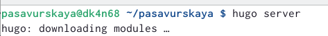{#fig:001 width=70%}

2) В домашней папке находим папку для сайта, там переходим в папку content, далее в документ _index.md. Там меняем нужные параметры, сверяясь с сайтом.

3) Меняем Skills.

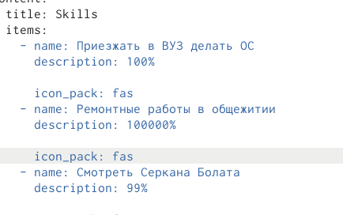{#fig:002 width=70%}

4) Меняем Experience.

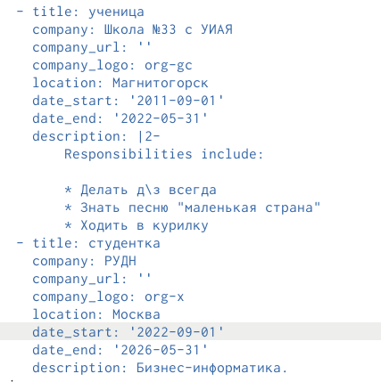{#fig:003 width=70%}

5) Меняем Accomplishments.

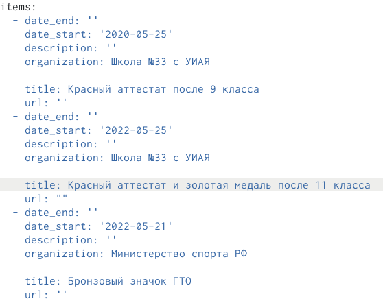{#fig:004 width=70%}

6) Чтобы сделать новый пост,в домашней папке находим папку для сайта, там переходим в папку content, далее в папку post, и в нужной папке меняем фото и вносим изменения в файл markdown. Пост на тему по выбору будет у меня про Markdown.

7) В терминале пишем команду hugo, чтобы начать сохранять изменения на сайте.

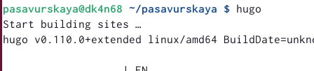{#fig:005 width=70%}

8) С помощью команд git add, git commit, git push отправляем измененные данные.

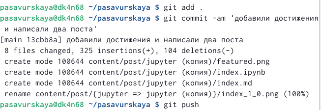{#fig:006 width=70%}

9) Переходим в папку public и вводим там команды git.

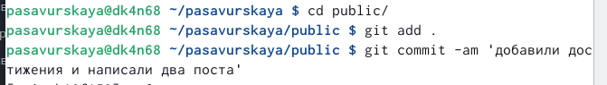{#fig:007 width=70%}

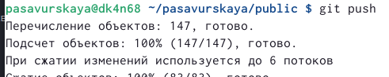{#fig:008 width=70%}

10) Готовые Skills.

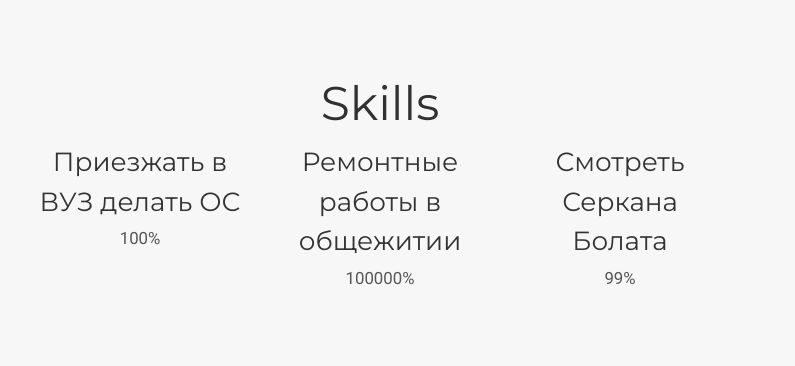{#fig:009 width=70%}

11) Готовые Experience.

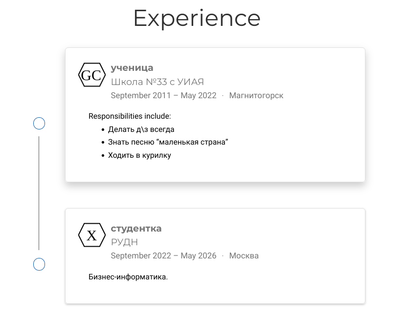{#fig:010 width=70%}

12) Готовые Accomplishments.

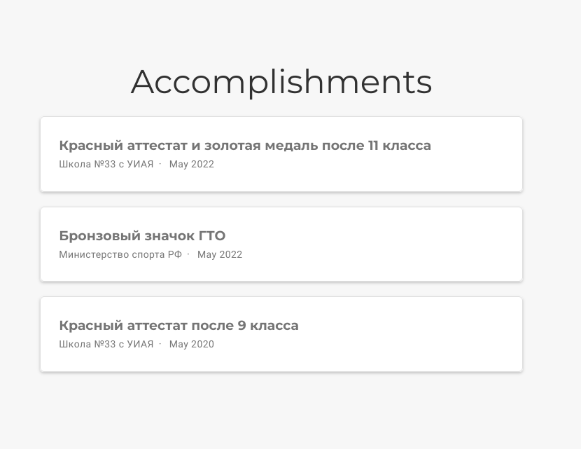{#fig:011 width=70%}

13) Готовые посты.

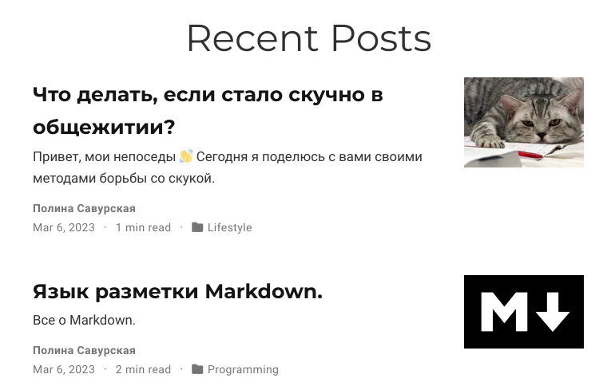{#fig:012 width=70%}

# Выводы

Я заполнила на сайте информацию о навыках, опыте, достижениях, и написала два поста.
