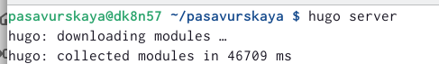
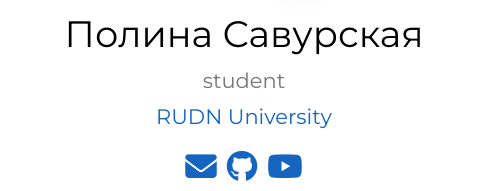
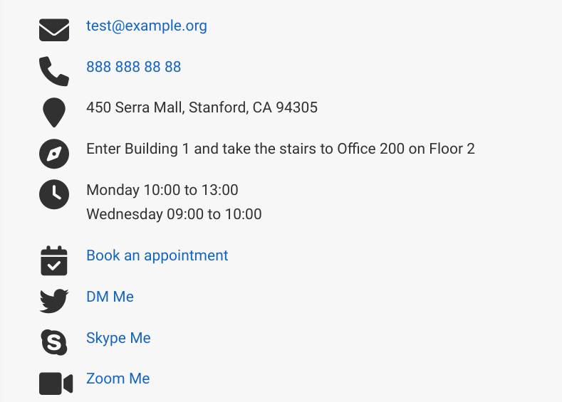
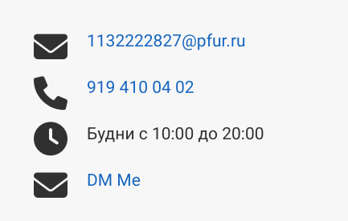
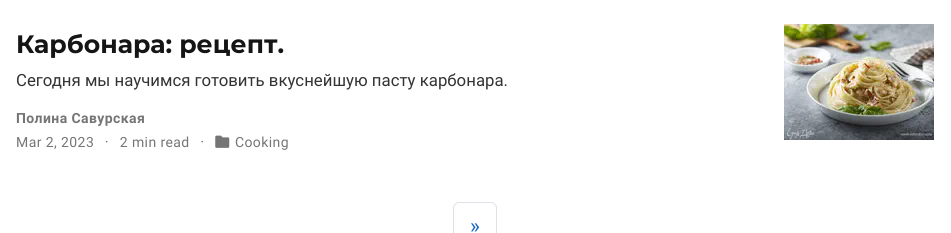
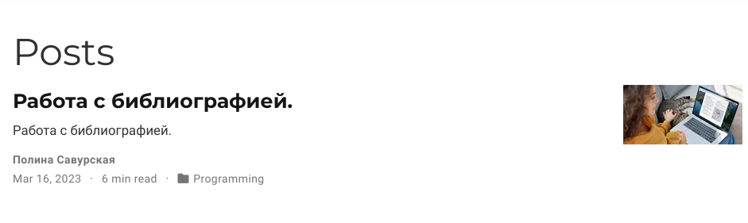
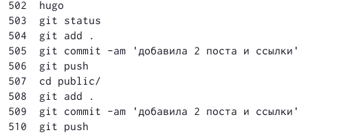

---
## Front matter
lang: ru-RU
title: Индивидуальный проект. Этап 4
subtitle: Операционные системы
author:
  - Савурская П. А., №студ.билета 1132222827
institute:
  - Российский университет дружбы народов, Москва, Россия
date: 25 марта 2023

## i18n babel
babel-lang: russian
babel-otherlangs: english

## Formatting pdf
toc: false
toc-title: Содержание
slide_level: 2
aspectratio: 169
section-titles: true
theme: metropolis
header-includes:
 - \metroset{progressbar=frametitle,sectionpage=progressbar,numbering=fraction}
 - '\makeatletter'
 - '\beamer@ignorenonframefalse'
 - '\makeatother'
---

## Цель работы.

Добавить к сайту ссылки на научные и библиометрические ресурсы. Добавить два поста.

## Задание.

1. Добавить к сайту ссылки на научные и библиометрические ресурсы. Зарегистрироваться на соответствующих ресурсах и разместить на них ссылки на сайте.

2. Сделать пост по прошедшей неделе.

3. Добавить пост на тему по выбору:

    Оформление отчёта.
    
    Создание презентаций.
    
    Работа с библиографией.

## Выполнение лабораторной работы. Шаг 1.

Начинаю работу с команды hugo server.

{#fig:001 width=70%}

## Выполнение лабораторной работы. Шаг 2.

Путем редактирования документов в папке content настраиваю свои ссылки на сайте.

{#fig:002 width=70%}

{#fig:003 width=70%}

## Выполнение лабораторной работы. Шаг 3.

Таким же образом устанавливаю информацию для обратной связи.

{#fig:004 width=70%}

{#fig:005 width=70%}

## Выполнение лабораторной работы. Шаг 4.

Добавляю новый пост и пост по теме "Работа с библиографией". 

{#fig:006 width=70%}

{#fig:007 width=70%}

## Выполнение лабораторной работы. Шаг 5.

Заключительным этапом делаю приведенный ниже список команд.

{#fig:008 width=70%}

## Выводы

Я добавила к сайту ссылки на научные и библиометрические ресурсы. Добавила два поста.
