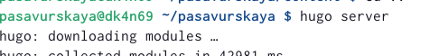
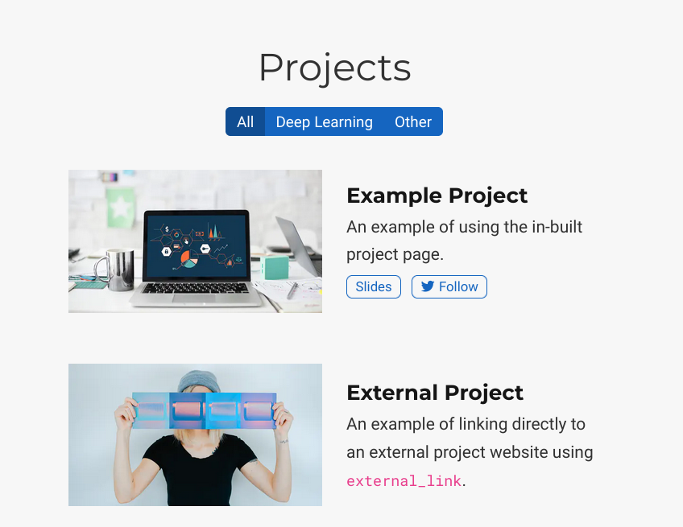
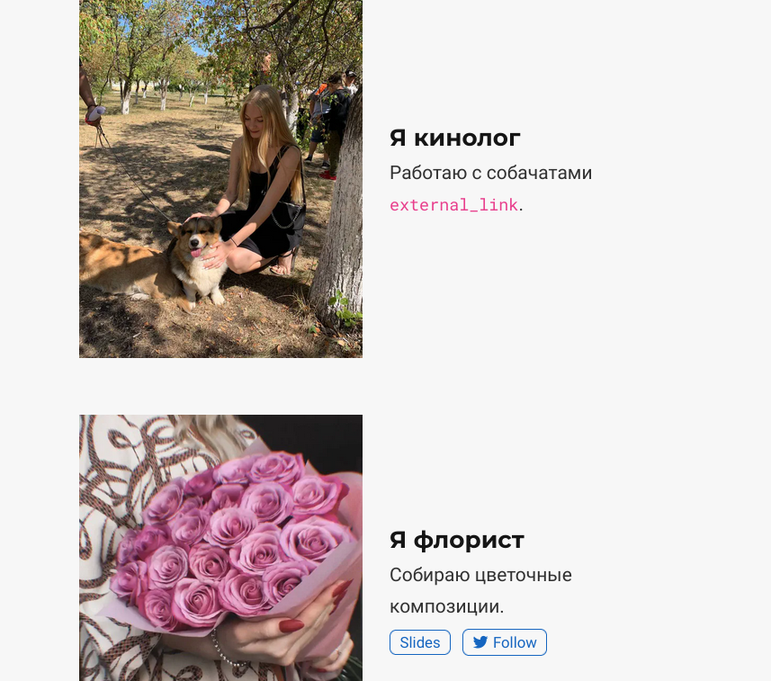
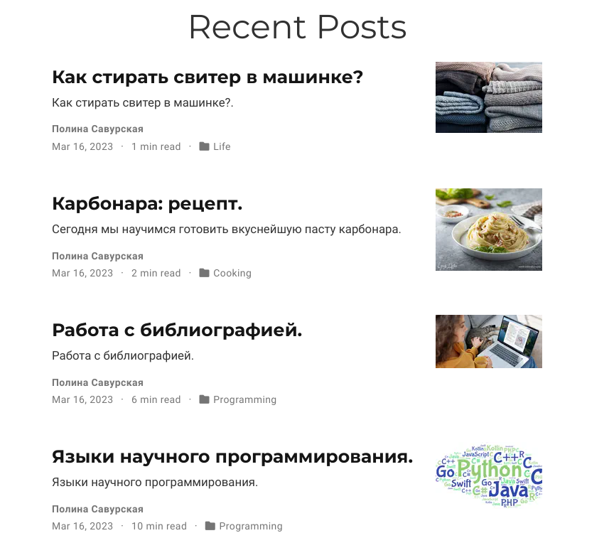
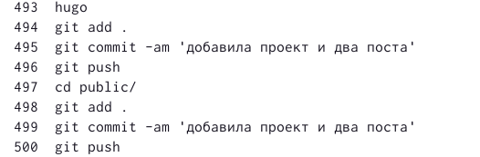

---
## Front matter
lang: ru-RU
title: Индивидуальный проект. Этап 5
subtitle: Операционные системы
author:
  - Савурская П. А., №студ.билета 1132222827
institute:
  - Российский университет дружбы народов, Москва, Россия
date: 23 апреля 2023

## i18n babel
babel-lang: russian
babel-otherlangs: english

## Formatting pdf
toc: false
toc-title: Содержание
slide_level: 2
aspectratio: 169
section-titles: true
theme: metropolis
header-includes:
 - \metroset{progressbar=frametitle,sectionpage=progressbar,numbering=fraction}
 - '\makeatletter'
 - '\beamer@ignorenonframefalse'
 - '\makeatother'
---

## Цель работы

Добавить к сайту записи для персональных проектов. Добавить два поста.

## Задание

1. Добавить с сайту все остальные элементы.

2. Сделать записи для персональных проектов.

3. Сделать пост по прошедшей неделе.

4. Добавить пост на тему ''Языки научного программирования''.
    
## Выполнение лабораторной работы. Шаг 1.

Начинаю работу с команды hugo server.

{#fig:001 width=70%}

## Выполнение лабораторной работы. Шаг 2.

Путем редактирования документов в папке content добавляю записи для персональных проектов на сайте.

{#fig:002 width=30%} {#fig:003 width=30%}

## Выполнение лабораторной работы. Шаг 3.

Добавляю новый пост и пост по теме "Языки научного программирования". 

{#fig:004 width=70%}

## Выполнение лабораторной работы. Шаг 4.

Заключительным этапом делаю приведенный ниже список команд.

{#fig:008 width=70%}

## Выводы

Я добавила к сайту персональные проекты. Добавила два поста.
